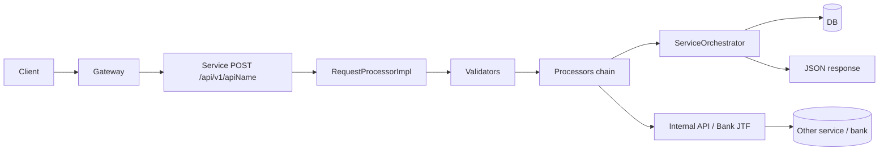

# sliProd — System architecture map

**Scope**: Workspace layout as checked in this repo (multi-repo folders under one root). **Authoritative runtime behaviour**: orchestration XML + processors + DB + logs; this file orients agents quickly.

## 0. Build topology (verified)

- **`novopay-platform-accounting-v2`** uses a **Gradle composite / included build** for **`novopay-platform-lib`** (output of `./gradlew projects` in accounting-v2: *Included builds → `:novopay-platform-lib`*).
- **`novopay-platform-lib`** root `./gradlew projects` lists **32 subprojects** (infra-*, util-platform, hierarchy-builder, adapter-aadhaar-xsd) — use that command after dependency or module changes.

## 1. Microservices and boundaries

| Directory | Role | Typical data store | Entry style |
|-----------|------|-------------------|-------------|
| `novopay-platform-api-gateway` | Single HTTP entry for clients; auth, session, rate limit, STAN dedupe, forwards to backends | Gateway DB (sessions, clients, STAN, forward URLs) | REST → `NovopayAPIClient` / internal calls |
| `novopay-platform-accounting-v2` | LMS core: loan accounts, disbursement/repayment, GL/posting, EOD batches, SI/eNACH, insurance/DCF paths | `mfi_accounting` (Yugabyte) schema typical | REST `/api/{version}/{apiName}` via **infra-service-gateway** + Spring Batch + Kafka consumers |
| `novopay-mfi-los` | Loan origination, applications, disbursement producer, sync consumers | LOS schema | REST + Kafka |
| `novopay-platform-actor` | Customers, employees, meetings, KYC-adjacent data | Actor schema | REST / orchestration |
| `novopay-platform-payments` | Collections rails, schedules, payment integrations | Payments schema | REST + callbacks via gateway |
| `novopay-platform-task` | Workflow tasks | Task schema | REST |
| `novopay-platform-masterdata-management` | Master data, **business date** (`updateBusinessDate`) | Masterdata schema | REST + batch |
| `novopay-platform-authorization` | Roles / usecases / permissions | AuthZ schema | REST |
| `novopay-platform-approval` | Maker-checker drafts | Approval schema | REST |
| `novopay-platform-audit` | Audit trail consumption | Audit schema | Kafka + REST |
| `novopay-platform-notifications` | SMS/email/push | Notifications | Kafka consumers |
| `novopay-platform-dms` | Documents | DMS | REST via gateway |
| `novopay-platform-batch` | Batch orchestration infra (as used by platform) | Varies | Schedulers / APIs |
| `trustt-platform-reporting` | Reporting | Varies | Separate pipeline |
| `novopay-platform-simulators` | Test doubles (e.g. chameleon) | N/A | Dev/test |
| `novopay-platform-dependency-mgmt` | Version BOM / shared dependency coordinates | N/A | Gradle |

**Not in this list**: `aicodegen/`, `trustt-platform-ai-codegen-artifacts/` — documentation and codegen artifacts, not runtime services.

## 2. Accounting-v2 Spring Boot shell (verified)

```30:37:novopay-platform-accounting-v2/src/main/java/in/novopay/accounting/Application.java
@SpringBootApplication
@EnableAutoConfiguration(exclude = { DataSourceAutoConfiguration.class, FlywayAutoConfiguration.class })
@ComponentScan(basePackages = "in.novopay")
@EnableCaching
@EnableRetry
@EnableJpaRepositories(basePackages = {"in.novopay.*"})
@EntityScan(basePackages = {"in.novopay.*"})
```

- **DataSource and Flyway** are intentionally **not** auto-configured here; **infra-platform** owns dynamic datasource / migration setup (see class Javadoc in same file).

## 3. Orchestration surface area — accounting-v2 (verified counts)

`grep -c '<Request name=' deploy/application/orchestration/*.xml` in **accounting-v2**:

| File | `<Request name=` count |
|------|------------------------:|
| `ServiceOrchestrationXML.xml` | 138 |
| `loans_orc.xml` | 82 |
| `mfi_orc.xml` | 59 |
| `loans_insurance_orc.xml` | 26 |
| `group_mfi_orc.xml` | 19 |
| `product_transaction_orc.xml` | 12 |
| `product_transaction_accounting_definition_orc.xml` | 12 |
| `insurance_orc.xml` | 12 |
| `loans_notification.xml` | 2 |

**Implication**: API discovery by “read one file” is insufficient; use `grep '<Request name='` when mapping entrypoints.

## 4. Shared platform libraries (`novopay-platform-lib/`)

Gradle composite modules (see `settings.gradle`):

- **infra-platform**: `AbstractProcessor`, validators, annotations, exceptions, tenant/thread context. **Spring Boot plugin: 3.2.11** (see `infra-platform/build.gradle`).
- **infra-navigation**: `ServiceOrchestrator`, `RequestProcessor`, orchestration XML parsing, transaction boundary behaviour, `CallInternalOrchestrationProcessor`. **Spring Boot plugin: 3.2.11** (see `infra-navigation/build.gradle`).
- **infra-service-gateway**: `ServiceGatewayController` — `POST /api/{apiVersion}/{apiName}` → `RequestProcessorImpl` → orchestration.
- **infra-jtf**: JSON Template Framework for bank/integration request–response mapping.
- **infra-http-client**: `NovopayHttpAPIClient`, internal HTTP client patterns.
- **infra-cache** / **infra-cache-gateway**: Redis clients, DB index conventions per service.
- **infra-message-broker**: Kafka producer/consumer abstractions (`NovopayMessageBrokerConsumer`, etc.).
- **infra-batch**: Spring Batch integration helpers.
- **Domain client libs**: `infra-accounting`, `infra-actor`, `infra-authorization`, `infra-task`, `infra-masterdata`, `infra-approval`, `infra-notifications`, `infra-reporting`.
- **Bank / payment**: `infra-transaction-hdfc`, `indusind`, `ccavenue`, `paytm`, `veri5`, `matm-payswiff`, `infra-transaction-interface`, `infra-transaction-internal-interface`.
- **Other**: `util-platform`, `hierarchy-builder`, `infra-rule-engine`, `infra-essentials-mysql`, `infra-essentials-elasticsearch`, `infra-service-security`, `adapter-aadhaar-xsd`.

Services depend on these as Gradle dependencies; **do not duplicate** framework concerns in service code.

## 5. Inter-service communication patterns

1. **Synchronous HTTP**
   - External clients → **API Gateway** → backend service HTTP (resolved by apiName / service registry / config).
   - Service-to-service: `NovopayInternalAPIClient` / `NovopayHttpInternalAPIClient` (orchestration-driven) — **separate transaction** from caller.

2. **Same JVM “internal API”**
   - `CallInternalOrchestrationProcessor` builds a new `ExecutionContext` and runs another Request with **explicit** transaction management — still not a shared DB transaction with the outer flow.

3. **Kafka**
   - Tenant-suffixed topics. **Accounting broker config**: `novopay-platform-accounting-v2/deploy/application/messagebroker/MessageBroker.xml` (see `.cursor/service-contracts.md` for beans). Broader contracts: `system_brain/events/kafka_topics.md`.

4. **No gRPC** observed as the primary pattern in this workspace; the spine is REST + Kafka + batch.

## 5A. Multi-Node Batch Processing Architecture (branch: `multinode_v3.2.8.2` — analyzed, not yet in production)

**Scope:** `novopay-platform-batch` service-side scheduler/executor behavior + platform-lib batch utilities used by services. This “multi-node” design is **multi-instance safe scheduling intent** (shared DB checks) + **in-process parallel execution**, not an explicit cluster with membership/leader election.

### Important distinction: “scheduler multi-node” vs “Spring Batch manager/worker”

There are **two different “multi-node” concepts** in this workspace and they are easy to conflate:

- **A) Scheduler multi-instance (service: `novopay-platform-batch`)**
  - Multiple instances of the *scheduler service* may run.
  - The branch implements “cluster intent” mainly via DB status checks (`isJobRunning` / `canStart`), but **no leader election / distributed lock** is present → race risk.
  - Documented gaps: `.cursor/gaps-and-risks.md` (High: no distributed leader/lock; Medium: in-memory dependency tracking).

- **B) Spring Batch remote partitioning manager/worker (platform-lib: `novopay-platform-lib/infra-batch`)**
  - For an individual batch job, execution can be **single-node** or **manager/worker remote partitioning** (Kafka-backed) depending on per-job DB parameter `is_multi_node` and active profiles.
  - Routing/entry points:
    - `infra-batch/.../builder/CustomCommonStepBuilder.java` (selects `CustomStepBuilder` vs `CustomKafkaStepBuilder`)
    - `infra-batch/.../service/ParallelCommonBatchJob.java` (selects `ParallelBatchJobV2` vs `ParallelKafkaBatchJob`)
  - The manager produces partition requests to Kafka topics; workers consume and process partitions.
  - Execution behavior can be overridden via DB `batch_job_parameter` flags like `force_async`, `force_task_executor`, `force_msg_driven`, etc. (see `.cursor/multinode-batch.md` §4A).

### Topology and distribution model

- **Scheduler service:** `novopay-platform-batch` runs scheduled batch groups and triggers jobs via internal HTTP.
- **Distribution mechanism:** **in-process parallelism** using `CompletableFuture.runAsync(...)` on a fixed thread pool (`Executors.newFixedThreadPool(50)`) in:
  - `novopay-platform-batch/src/main/java/in/novopay/batch/core/service/SchedulerCommonService.java`
- **Cross-node coordination:** **implicit** via shared Spring Batch execution tables queried through `JobService` and `BatchScheduleService`:
  - `BatchScheduleService.canStart(...)` uses “is any job STARTING/STARTED” checks across last executions.
  - `BatchScheduleService.isJobRunning(...)` consults `JobService.getLastJobExecution(jobName)`.

### Node discovery / leader election

- **Node registration / discovery:** **None found** in code (no membership store, heartbeats, node IDs).
- **Leader election:** **None found**. If multiple `novopay-platform-batch` instances run, they rely on “isJobRunning” DB checks rather than a single elected leader.

### Job partitioning strategy

- **Job-level parallelization:** Jobs are grouped by “root priority” (e.g., `1`, `2`) and executed in parallel within the same root priority bucket; sub-jobs wait on parent completion based on hierarchical priority strings (`1.1`, `1.2`, `2.1.1`, ...).
- **Dependency tracking:** `jobCompletionStatus` is an **in-memory** `ConcurrentHashMap<String, Boolean>` keyed by priority string — scoped to one JVM.

### Failure handling / recovery

- **Job failure handling:** If a job is FAILED/ABANDONED/UNKNOWN, the scheduler attempts a restart via `reTryForFailed(...)` which calls:
  - `batchJobService.fixJobExecutionStatus(jobName)`
  - `batchJobService.setExecutionParams(...)`
  - internal API call with `op_code=RESTART`
- **Unknown status cleanup on startup:** `BatchScheduleService.autoSchedule(...)` calls `fixUnknownStateJobs(...)` which delegates to `jobService.fixUnknownJob(...)`.

### Distributed-systems risk surface (important)

- **Race windows across nodes:** Coordination is not a distributed lock; multiple scheduler instances can still race between DB reads and job starts.
- **Dependency map is per-node:** `jobCompletionStatus` is not persisted; in a multi-node deployment, dependency enforcement is only correct per-node, not cluster-wide.

See full reference: `.cursor/multinode-batch.md`.

## 6. Request lifecycle (orchestrated microservice)



- **Orchestration**: `deploy/application/orchestration/*.xml` — `Request` elements name the API; validators, processors, controls, optional `<Transaction>` blocks, HTTP method → implicit vs explicit transactions.

## 7. Database and migrations

- **Engine**: YugabyteDB (PostgreSQL protocol) per `.cursorrules` / service configs.
- **Schema-per-domain**: e.g. `mfi_accounting`, `mfi_los`, … — see data dictionaries under `trustt-platform-ai-codegen-artifacts-java/sli/schema_structure/data_dictionaries/`.
- **Migrations**: Flyway/Liquibase patterns per service (verify in each repo’s `deploy` or `src/main/resources/db`).

## 8. Auth, middleware, tenancy

- **Gateway**: Client keys, session token, optional OTP validation hooks, authorization usecase check, rate limits, STAN dedupe (Redis or DB).
- **Service**: `ServiceGatewayController` uses `SecurityManager` (OTP path), parses headers/body into a map, sets MDC (`tenant`, `stan`, `user-handle`, …).
- **Multi-tenant**: `PlatformTenant`, `ThreadLocalContext.setTenant()` — Redis keys and queries must stay tenant-scoped.

## 9. Config / environment

- Spring Boot `application.yml` + env overrides (`${ENV_VAR:default}`).
- Per-service `deploy/application/` — orchestration, message broker XML, templates under `deploy/application/templates/`.
- **Secrets**: must not be committed; local `build.gradle` may reference private Nexus — treat as environment-specific.

## 10. Workspace documentation layers (how they fit)

| Layer | Path | Use |
|-------|------|-----|
| Agent rules | `.cursorrules`, `.cursor/rules/*.mdc` | Enforce behaviour, contracts, financial gates |
| **Flow Sync graph (system-level)** | **`.cursor/knowledge-graph.md`**, **`.cursor/knowledge-graph.mmd`**, **`api-catalogue.md`**, **`cross-service-transactions.md`**, **`flow-sync-progress.md`** | Money paths, edges (ALIGNED/DRIFT/MISMATCH), SPOFs, API/topic inventory, multi-service txn rows |
| This knowledge base | `.cursor/*.md` (this file set) | Architecture + contracts summary |
| Curated brain | `system_brain/` | Flows, edge cases, batch inventory, runbooks |
| Deep specs | `trustt-platform-ai-codegen-artifacts-java/sli/` | Framework docs, API specs, data dictionaries |
| Service context | `*/CLAUDE.md` in some repos | Quick service-specific orientation |

## 11. `.cursor/docs/` — agent quick references (read fully; do not duplicate here)

| File | Contents |
|------|----------|
| `.cursor/docs/glossary.md` | Modules, infra libs, domain terms (LAN, NEFT, KFS), ExecutionContext/orchestration/JTF definitions, error-code ranges, sample status enums |
| `.cursor/docs/patterns-and-examples.md` | Processor/service/repository snippets, Kafka consumer sketch, `callInternalAPI` + **separate transaction** warning, bank call + validator XML examples |
| `.cursor/docs/anti-patterns.md` | put vs putLocal leaks, JPQL vs native, N+1, Kafka swallow, contract/KFS mistakes, `loan_amount` vs `approved_amount`, fat processors |
| `.cursor/docs/testing-patterns.md` | Mockito for processors/services/consumers; financial formula tests; what to mock per layer (**tests optional** unless user/TRD asks) |
| `.cursor/docs/faq.md` | New API steps (templates + ORC), errors, ExecutionContext vs params, soft delete, inter-service calls + txn boundaries, native SQL preference |

## 12. `system_brain/flows/` — money-path runbooks (summaries; full detail in each file)

| File | One-line focus |
|------|----------------|
| `disbursement.md` | LOS Kafka payload + Redis keys, `LmsMessageBrokerConsumer`, LOS sync **`entity_type`** gap, `disbursement_status` write points, NEFT callbacks |
| `repayment_posting.md` | `loanRepayment` / `childLoanRepayment` nested **`postTransaction`** count + txn type selection from ORC |
| `prepayment_foreclosure_writeoff_refund_rebooking_posting.md` | `loanPrepayment`, `loanWriteoff`, `loanDisbursementCancellation`, excess refund, `loanAccountRebooking` → `postTransaction` shapes |
| `accounting_async_events_money_state.md` | Disburse/closure/collections/SMS topic names and mandatory keys (compact) |
| `bank_callbacks_inquiries.md` | `doGenericSyncSTPBankNEF/NEI*CallBack`, `DoGenericSyncSTPBankNeftCallBackProcessor`, inquiry via `CallBankAPIForDisbursementProcessor` |
| `disbursement_cancellation_tax_reversal.md` | `SGToDisbursementCancellationIWriter`, `InitiateCancellationTaxReversalProcessor`, GST external call + reversal flags |
| `gl_balance_zeroisation_posting.md` | `glBalanceZeroisation` **bypasses** `postTransaction` Request — direct master/partition/details processors |
| `insurance_inbound_posting.md` | DCF inbound jobs → `DeathForeclosureInsuranceWriter`, disb-cancellation bulk → `LOAN_DISB_CNCL`, post-disb insurance **no** `postTransaction` |
| `reversals_manual_journal_transaction_engine.md` | `reverseTransactionProcessor` lookup order, Cr/Dr swap, manual JE dedupe `134067` |

Deep accounting column semantics and NEFT/CLMT detail remain in **`.cursor/rules/accounting.mdc`** (Module reference section; do not merge that detail into these summaries).

---

*Verify versions in each service `build.gradle` before implementing; infra lib Boot version may differ from service Boot version.*
