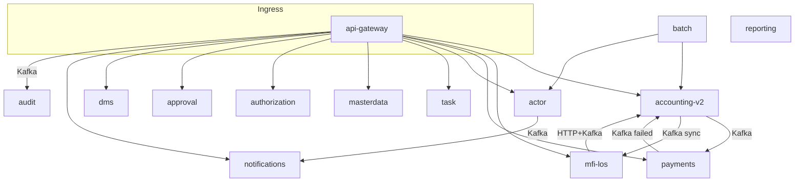

# Service dependency graph (rebuilt)

**Scope:** 14 runtime services in sliProd workspace (12 `novopay-platform-*` + `novopay-mfi-los` + `trustt-platform-reporting`) plus shared `novopay-platform-lib`. **Date:** 2026-04-10. **Sources:** `NovopayInternalAPIClient` / `NovopayHttpInternalAPIClient`, orchestration `<API>` usage patterns, per-service `deploy/application/messagebroker/MessageBroker.xml`, `.cursor/event-registry.md`.

## 0) Legend

| Symbol | Meaning |
|--------|---------|
| `callInternalAPI(...)` | Platform internal HTTP (or same-JVM orchestration hop via `doSameServiceCall`) from `NovopayInternalAPIClient` |
| **FAIL if down** | User-visible or async backlog symptom when the callee is unavailable |
| **Consistency** | Whether money/state can diverge across stores if the call fails mid-flow |

## 1) HTTP transport — how calls are made

1. **Entry:** External clients hit **`novopay-platform-api-gateway`** → forwards to a **destination service** URL from `ServiceRegistry` (per `apiName`).

2. **Orchestration:** Inside a service, `<API name="..."` steps invoke **`NovopayInternalAPIClient.callInternalAPI(executionContext, apiName, apiVersion, apiIdentifier, connectionTimeout, socketTimeout, generateStan)`** (`novopay-platform-lib/infra-navigation/.../NovopayInternalAPIClient.java`).

3. **Same service:** If `serviceRegistry.getAPIServiceName(apiName)` equals `novopay.service.name`, **`doSameServiceCall`** runs a nested `ServiceOrchestrator.processRequest` in-process (still **separate explicit transaction** per framework rules).

4. **Remote:** Otherwise **`NovopayHttpInternalAPIClient`** issues HTTP to the peer service. **No retry/circuit breaker** on `NovopayHttpAPIClient` (documented High gap).

5. **Timeouts:** Per-call `connectionTimeout` / `socketTimeout` are passed from orchestration/processors (not a single global property). Gateway exposes `novopay.internal.api.socket.timeout` for its own client configuration.

## 2) Caller → Callee → Method — HTTP / internal API matrix

> **Method column** names the platform mechanism. Individual `apiName` values number in the **hundreds** (see `.cursor/orchestration-map.md`). Below: **representative callees** and **failure semantics**.

| Caller service | Typical callee | Method | What fails if callee is down | Data consistency impact |

|----------------|----------------|--------|------------------------------|-------------------------|

| api-gateway | All registered business services (ACCOUNTING, ACTOR, LOS, PAYMENTS, …) | HTTP proxy + registry lookup | All API calls return 5xx/timeout to client; session/STAN may be partial | No ledger write in gateway DB for business data; client may retry → depends on idempotency of target API |
| api-gateway | authorization | `NovopayInternalAPIClient` / `checkPermissionByUsecase` (when mapping exists) | Permission check errors or skipped path if mapping missing (GAP-054) | False deny or false allow class of bugs; not a money ledger |
| mfi-los | accounting-v2 | `callInternalAPI` + `disburseLoan` / charges / mandate APIs | Disbursement cannot complete; Kafka `disburse_loan_api_` may still fire if HTTP path already committed | LOS vs LMS divergence if async path succeeds later without LOS sync |
| mfi-los | task | `callInternalAPI` (ops tasks, portfolio) | Task creation/update fails | Workflow stalls; no automatic money movement from task service alone |
| mfi-los | actor | `callInternalAPI` (customer, employee) | LOS screens and validations fail | Origination blocked; no loan booking |
| accounting-v2 | actor | `callInternalAPI` (employee, office, customer, group) | Orchestration steps fail → whole request FAIL | Transaction boundary rolls back current step batch; prior committed inter-service calls may stand (partial failure) |
| accounting-v2 | masterdata-management | `callInternalAPI` (codes, business date) | Validation and date-stamped posting fail | Wrong `job_time` / business date if cached elsewhere (operational risk) |
| accounting-v2 | authorization | `callInternalAPI` permission APIs | Steps requiring auth fail | No posting in that request |
| accounting-v2 | payments | `callInternalAPI` collection/allocation APIs | Repayment allocation flows fail | Accounting ledger may post while payments leg pending → reconciliation |
| accounting-v2 | notifications | `callInternalAPI` / infra notification processors | SMS/email not sent | Money state may still commit; customer unaware |
| accounting-v2 | task | `callInternalAPI` portfolio / workflow | Transfer / task steps fail | Partial portfolio transfer risk if multi-step |
| accounting-v2 | approval | `callInternalAPI` maker-checker | Approval queue path fails | No state change requiring approval |
| payments | accounting-v2 | `callInternalAPI` LMS updates / allocations | Collection sync to LMS fails | Payments DB has collection; accounting outstanding may lag |
| payments | actor | `callInternalAPI` office/customer | Collection enrichment fails | Incomplete collection metadata |
| task | actor | `callInternalAPI` | Task assignment resolution fails | Tasks not created / wrong assignee |
| task | accounting-v2 | `callInternalAPI` | Portfolio / loan actions fail | Ops workflows stall |
| task | notifications | `callInternalAPI` / processors | Escalation SMS fails | Operational only |
| batch (platform-batch) | accounting-v2, actor, … | `NovopayInternalAPIClient` with `function_sub_code=BATCH` | Scheduled job fails; no file output | Depends on job; may leave staging partial |
| approval | accounting-v2, los, actor, task | `target_api_name` on approve | Approval completion cannot execute target | Maker state committed; checker action blocked |
| authorization | actor | User / role fetch APIs | Permission resolution fails | Deny or error; gateway coupling |
| actor | notifications | Async Kafka preferred; HTTP path possible via lib | Notification delay | Eventual consistency |
| dms | actor/accounting (orchestration) | `callInternalAPI` patterns | Document metadata flows fail | DMS orphan / missing link |

## 3) Kafka edges — producer → topic → consumer → consumer-down failure

| # | Producer (typical) | Topic prefix | Consumer service | Consumer bean / class | If consumer is down | Consistency |

|---|------------------|--------------|------------------|----------------------|---------------------|-------------|

| 1 | LOS / lib | disburse_loan_api_ | accounting-v2 | lmsMessageBrokerConsumer | Disburse messages backlog; LOS may show in-flight; Redis dedupe keys risk | Eventual disburse or stuck unless replay |
| 2 | accounting-v2 | los_lms_disbursement_sync | mfi-los | DisbursementSyncConsumer | LOS failure_reason not updated | Accounting thinks notified; LOS diverges |
| 3 | accounting-v2 | bulk_collection_data_ | payments | createOrUpdateBulkCollectionConsumer | Collections not allocated | Accounting posted recurring; payments lag |
| 4 | payments | bulk_collection_data_failed_ | accounting-v2 | bulkCollectionFailedRecordConsumer | Failed rows not reconciled | Stale failure state |
| 5 | api-gateway | api_gateway_request_ | audit | RequestMessageBrokerConsumer | CRR not in audit ES/DB | Audit trail gap |
| 6 | actor | async_notifications_ | notifications | NotificationMessageBrokerConsumer | SMS/email backlog | User comms delayed |
| 7 | actor | collection_customer_details_ | payments | PopulateCollectionCustomerDetailsConsumer | Customer facet missing | Collection UI incomplete |

### 3a) All configured consumers (`MessageBroker.xml`) — poll / threads / maxPollRecords

| Service | topicPrefix | group prefix | pollTime ms | threads | maxPollRecords | bean | file |

|---------|-------------|--------------|------------|---------|----------------|------|------|

| novopay-mfi-los | geo_tracking_audit_ | geo_tracking_audit_ | 2000 | 2 | 2 | geoTrackerAuditConsumer | `novopay-mfi-los/deploy/application/messagebroker/MessageBroker.xml` |
| novopay-mfi-los | geo_tracking_login_logout_audit_ | geo_tracking_login_logout_audit_ | 3000 | 2 | 1 | geoTrackerLoginLogoutAuditConsumer | `novopay-mfi-los/deploy/application/messagebroker/MessageBroker.xml` |
| novopay-mfi-los | posidex_los_inbound_ | posidex_inbound_los_consumer | 3000 | 1 | (default) | posidexInboundLosConsumer | `novopay-mfi-los/deploy/application/messagebroker/MessageBroker.xml` |
| novopay-mfi-los | posidex_los_outbound_ | posidex_outbound_los_consumer | 3000 | 1 | (default) | posidexOutboundLosConsumer | `novopay-mfi-los/deploy/application/messagebroker/MessageBroker.xml` |
| novopay-mfi-los | indl_qde_borrower_onboarding_factiva_service_ | indl_qde_borrower_onboarding_factiva_ | 3000 | 1 | 1 | factivaConsumer | `novopay-mfi-los/deploy/application/messagebroker/MessageBroker.xml` |
| novopay-mfi-los | indl_qde_borrower_default_factiva_service_retry_ | indl_qde_borrower_default_factiva_retry_ | 3000 | 1 | 1 | factivaConsumer | `novopay-mfi-los/deploy/application/messagebroker/MessageBroker.xml` |
| novopay-mfi-los | indl_qde_borrower_qde_factiva_service_retry_ | indl_qde_borrower_qde_factiva_retry_ | 3000 | 1 | 1 | factivaConsumer | `novopay-mfi-los/deploy/application/messagebroker/MessageBroker.xml` |
| novopay-mfi-los | indl_qde_borrower_default_internal_dedupe_service_retry_ | indl_qde_borrower_default_internal_dedupe_retry_ | 3000 | 1 | 1 | internalDedupeConsumer | `novopay-mfi-los/deploy/application/messagebroker/MessageBroker.xml` |
| novopay-mfi-los | indl_qde_borrower_qde_internal_dedupe_service_retry_ | indl_qde_borrower_qde_internal_dedupe_retry_ | 3000 | 1 | 1 | internalDedupeConsumer | `novopay-mfi-los/deploy/application/messagebroker/MessageBroker.xml` |
| novopay-mfi-los | indl_qde_borrower_onboarding_posidex_service_ | indl_qde_borrower_onboarding_posidex_ | 5000 | 1 | 1 | posidexConsumer | `novopay-mfi-los/deploy/application/messagebroker/MessageBroker.xml` |
| novopay-mfi-los | indl_qde_borrower_onboarding_posidex_service_second_call_ | indl_qde_borrower_onboarding_posidex_second_call_ | 6000 | 1 | 1 | posidexSecondCallConsumer | `novopay-mfi-los/deploy/application/messagebroker/MessageBroker.xml` |
| novopay-mfi-los | indl_qde_borrower_onboarding_multi_bureau_service_ | indl_qde_borrower_onboarding_multi_bureau_ | 6000 | 1 | 1 | multiBureauConsumer | `novopay-mfi-los/deploy/application/messagebroker/MessageBroker.xml` |
| novopay-mfi-los | indl_qde_borrower_default_posidex_service_retry_ | indl_qde_borrower_default_posidex_retry_ | 5000 | 1 | 1 | posidexConsumer | `novopay-mfi-los/deploy/application/messagebroker/MessageBroker.xml` |
| novopay-mfi-los | indl_qde_borrower_default_posidex_service_second_call_retry_ | indl_qde_borrower_default_posidex_second_call_retry_ | 6000 | 1 | 1 | posidexSecondCallConsumer | `novopay-mfi-los/deploy/application/messagebroker/MessageBroker.xml` |
| novopay-mfi-los | indl_qde_borrower_qde_posidex_service_retry_ | indl_qde_borrower_qde_posidex_retry_ | 5000 | 1 | 1 | posidexConsumer | `novopay-mfi-los/deploy/application/messagebroker/MessageBroker.xml` |
| novopay-mfi-los | indl_qde_borrower_qde_posidex_service_second_call_retry_ | indl_qde_borrower_qde_posidex_second_call_retry_ | 6000 | 1 | 1 | posidexSecondCallConsumer | `novopay-mfi-los/deploy/application/messagebroker/MessageBroker.xml` |
| novopay-mfi-los | indl_qde_borrower_default_multi_bureau_service_retry_ | indl_qde_borrower_default_multi_bureau_retry_ | 6000 | 1 | 1 | multiBureauConsumer | `novopay-mfi-los/deploy/application/messagebroker/MessageBroker.xml` |
| novopay-mfi-los | indl_qde_borrower_qde_multi_bureau_service_retry_ | indl_qde_borrower_qde_multi_bureau_retry_ | 6000 | 1 | 1 | multiBureauConsumer | `novopay-mfi-los/deploy/application/messagebroker/MessageBroker.xml` |
| novopay-mfi-los | indl_qde_co_borrower_onboarding_factiva_service_ | indl_qde_co_borrower_onboarding_factiva_ | 3000 | 1 | 1 | factivaConsumer | `novopay-mfi-los/deploy/application/messagebroker/MessageBroker.xml` |
| novopay-mfi-los | indl_qde_co_borrower_default_factiva_service_retry_ | indl_qde_co_borrower_default_factiva_retry_ | 3000 | 1 | 1 | factivaConsumer | `novopay-mfi-los/deploy/application/messagebroker/MessageBroker.xml` |
| novopay-mfi-los | indl_qde_co_borrower_qde_factiva_service_retry_ | indl_qde_co_borrower_qde_factiva_retry_ | 3000 | 1 | 1 | factivaConsumer | `novopay-mfi-los/deploy/application/messagebroker/MessageBroker.xml` |
| novopay-mfi-los | indl_qde_co_borrower_default_internal_dedupe_service_retry_ | indl_qde_co_borrower_default_internal_dedupe_retry_ | 3000 | 1 | 1 | internalDedupeConsumer | `novopay-mfi-los/deploy/application/messagebroker/MessageBroker.xml` |
| novopay-mfi-los | indl_qde_co_borrower_qde_internal_dedupe_service_retry_ | indl_qde_co_borrower_qde_internal_dedupe_retry_ | 3000 | 1 | 1 | internalDedupeConsumer | `novopay-mfi-los/deploy/application/messagebroker/MessageBroker.xml` |
| novopay-mfi-los | indl_qde_co_borrower_onboarding_posidex_service_ | indl_qde_co_borrower_onboarding_posidex_ | 5000 | 1 | 1 | posidexConsumer | `novopay-mfi-los/deploy/application/messagebroker/MessageBroker.xml` |
| novopay-mfi-los | indl_qde_co_borrower_onboarding_posidex_service_second_call_ | indl_qde_co_borrower_onboarding_posidex_second_call_ | 6000 | 1 | 1 | posidexSecondCallConsumer | `novopay-mfi-los/deploy/application/messagebroker/MessageBroker.xml` |
| novopay-mfi-los | indl_qde_co_borrower_onboarding_multi_bureau_service_ | indl_qde_co_borrower_onboarding_multi_bureau_ | 6000 | 1 | 1 | multiBureauConsumer | `novopay-mfi-los/deploy/application/messagebroker/MessageBroker.xml` |
| novopay-mfi-los | indl_qde_co_borrower_default_posidex_service_retry_ | indl_qde_co_borrower_default_posidex_retry_ | 5000 | 1 | 1 | posidexConsumer | `novopay-mfi-los/deploy/application/messagebroker/MessageBroker.xml` |
| novopay-mfi-los | indl_qde_co_borrower_default_posidex_service_second_call_retry_ | indl_qde_co_borrower_default_posidex_second_call_retry_ | 6000 | 1 | 1 | posidexSecondCallConsumer | `novopay-mfi-los/deploy/application/messagebroker/MessageBroker.xml` |
| novopay-mfi-los | indl_qde_co_borrower_qde_posidex_service_retry_ | indl_qde_co_borrower_qde_posidex_retry_ | 5000 | 1 | 1 | posidexConsumer | `novopay-mfi-los/deploy/application/messagebroker/MessageBroker.xml` |
| novopay-mfi-los | indl_qde_co_borrower_qde_posidex_service_second_call_retry_ | indl_qde_co_borrower_qde_posidex_second_call_retry_ | 6000 | 1 | 1 | posidexSecondCallConsumer | `novopay-mfi-los/deploy/application/messagebroker/MessageBroker.xml` |
| novopay-mfi-los | indl_qde_co_borrower_default_multi_bureau_service_retry_ | indl_qde_co_borrower_default_multi_bureau_retry_ | 6000 | 1 | 1 | multiBureauConsumer | `novopay-mfi-los/deploy/application/messagebroker/MessageBroker.xml` |
| novopay-mfi-los | indl_qde_co_borrower_qde_multi_bureau_service_retry_ | indl_qde_co_borrower_qde_multi_bureau_retry_ | 6000 | 1 | 1 | multiBureauConsumer | `novopay-mfi-los/deploy/application/messagebroker/MessageBroker.xml` |
| novopay-mfi-los | indl_qde_borrower_conduct_pd_factiva_service_ | indl_qde_borrower_conduct_pd_factiva_ | 3000 | 1 | 1 | factivaConsumer | `novopay-mfi-los/deploy/application/messagebroker/MessageBroker.xml` |
| novopay-mfi-los | indl_qde_borrower_conduct_pd_posidex_service_ | indl_qde_borrower_conduct_pd_posidex_ | 5000 | 1 | 1 | posidexConsumer | `novopay-mfi-los/deploy/application/messagebroker/MessageBroker.xml` |
| novopay-mfi-los | indl_qde_borrower_conduct_pd_posidex_service_second_call_ | indl_qde_borrower_conduct_pd_posidex_second_call_ | 6000 | 1 | 1 | posidexSecondCallConsumer | `novopay-mfi-los/deploy/application/messagebroker/MessageBroker.xml` |
| novopay-mfi-los | indl_qde_borrower_conduct_pd_multi_bureau_service_ | indl_qde_borrower_conduct_pd_multi_bureau_ | 6000 | 1 | 1 | multiBureauConsumer | `novopay-mfi-los/deploy/application/messagebroker/MessageBroker.xml` |
| novopay-mfi-los | indl_qde_co_borrower_conduct_pd_factiva_service_ | indl_qde_co_borrower_conduct_pd_factiva_ | 3000 | 1 | 1 | factivaConsumer | `novopay-mfi-los/deploy/application/messagebroker/MessageBroker.xml` |
| novopay-mfi-los | indl_qde_co_borrower_conduct_pd_posidex_service_ | indl_qde_co_borrower_conduct_pd_posidex_ | 5000 | 1 | 1 | posidexConsumer | `novopay-mfi-los/deploy/application/messagebroker/MessageBroker.xml` |
| novopay-mfi-los | indl_qde_co_borrower_conduct_pd_posidex_service_second_call_ | indl_qde_co_borrower_conduct_pd_posidex_second_call_ | 6000 | 1 | 1 | posidexSecondCallConsumer | `novopay-mfi-los/deploy/application/messagebroker/MessageBroker.xml` |
| novopay-mfi-los | indl_qde_co_borrower_conduct_pd_multi_bureau_service_ | indl_qde_co_borrower_conduct_pd_multi_bureau_ | 6000 | 1 | 1 | multiBureauConsumer | `novopay-mfi-los/deploy/application/messagebroker/MessageBroker.xml` |
| novopay-mfi-los | indl_cm_dashboard_borrower_default_factiva_service_ | indl_cm_dashboard_borrower_factiva_ | 3000 | 1 | 1 | factivaConsumer | `novopay-mfi-los/deploy/application/messagebroker/MessageBroker.xml` |
| novopay-mfi-los | indl_cm_dashboard_borrower_default_factiva_service_retry_ | indl_cm_dashboard_borrower_default_factiva_retry_ | 3000 | 1 | 1 | factivaConsumer | `novopay-mfi-los/deploy/application/messagebroker/MessageBroker.xml` |
| novopay-mfi-los | indl_cm_dashboard_borrower_default_internal_dedupe_service_retry_ | indl_cm_dashboard_borrower_default_internal_dedupe_retry_ | 3000 | 1 | 1 | internalDedupeConsumer | `novopay-mfi-los/deploy/application/messagebroker/MessageBroker.xml` |
| novopay-mfi-los | indl_cm_dashboard_borrower_default_posidex_service_ | indl_cm_dashboard_borrower_posidex_ | 5000 | 1 | 1 | posidexConsumer | `novopay-mfi-los/deploy/application/messagebroker/MessageBroker.xml` |
| novopay-mfi-los | indl_cm_dashboard_borrower_default_posidex_service_second_call_ | indl_cm_dashboard_borrower_posidex_second_call_ | 6000 | 1 | 1 | posidexSecondCallConsumer | `novopay-mfi-los/deploy/application/messagebroker/MessageBroker.xml` |
| novopay-mfi-los | indl_cm_dashboard_borrower_default_multi_bureau_service_ | indl_cm_dashboard_borrower_multi_bureau_ | 6000 | 1 | 1 | multiBureauConsumer | `novopay-mfi-los/deploy/application/messagebroker/MessageBroker.xml` |
| novopay-mfi-los | indl_cm_dashboard_borrower_default_posidex_service_retry_ | indl_cm_dashboard_borrower_default_posidex_retry_ | 5000 | 1 | 1 | posidexConsumer | `novopay-mfi-los/deploy/application/messagebroker/MessageBroker.xml` |
| novopay-mfi-los | indl_cm_dashboard_borrower_default_posidex_service_second_call_retry_ | indl_cm_dashboard_borrower_default_posidex_second_call_retry_ | 6000 | 1 | 1 | posidexSecondCallConsumer | `novopay-mfi-los/deploy/application/messagebroker/MessageBroker.xml` |
| novopay-mfi-los | indl_cm_dashboard_borrower_default_multi_bureau_service_retry_ | indl_cm_dashboard_borrower_default_multi_bureau_retry_ | 6000 | 1 | 1 | multiBureauConsumer | `novopay-mfi-los/deploy/application/messagebroker/MessageBroker.xml` |
| novopay-mfi-los | indl_cm_dashboard_borrower_posidex_service_ | indl_cm_dashboard_borrower_posidex_ | 5000 | 1 | 1 | posidexConsumer | `novopay-mfi-los/deploy/application/messagebroker/MessageBroker.xml` |
| novopay-mfi-los | indl_cm_dashboard_borrower_factiva_service_ | indl_cm_dashboard_borrower_factiva_ | 3000 | 1 | 1 | factivaConsumer | `novopay-mfi-los/deploy/application/messagebroker/MessageBroker.xml` |
| novopay-mfi-los | indl_cm_dashboard_borrower_posidex_service_second_call_ | indl_cm_dashboard_borrower_posidex_second_call_ | 6000 | 1 | 1 | posidexSecondCallConsumer | `novopay-mfi-los/deploy/application/messagebroker/MessageBroker.xml` |
| novopay-mfi-los | indl_cm_dashboard_borrower_multi_bureau_service_ | indl_cm_dashboard_borrower_multi_bureau_ | 6000 | 1 | 1 | multiBureauConsumer | `novopay-mfi-los/deploy/application/messagebroker/MessageBroker.xml` |
| novopay-mfi-los | indl_cm_dashboard_co_borrower_default_factiva_service_ | indl_cm_dashboard_co_borrower_factiva_ | 3000 | 1 | 1 | factivaConsumer | `novopay-mfi-los/deploy/application/messagebroker/MessageBroker.xml` |
| novopay-mfi-los | indl_cm_dashboard_co_borrower_default_factiva_service_retry_ | indl_cm_dashboard_co_borrower_default_factiva_retry_ | 3000 | 1 | 1 | factivaConsumer | `novopay-mfi-los/deploy/application/messagebroker/MessageBroker.xml` |
| novopay-mfi-los | indl_cm_dashboard_co_borrower_default_internal_dedupe_service_retry_ | indl_cm_dashboard_co_borrower_default_internal_dedupe_retry_ | 3000 | 1 | 1 | internalDedupeConsumer | `novopay-mfi-los/deploy/application/messagebroker/MessageBroker.xml` |
| novopay-mfi-los | indl_cm_dashboard_co_borrower_default_posidex_service_ | indl_cm_dashboard_co_borrower_posidex_ | 5000 | 1 | 1 | posidexConsumer | `novopay-mfi-los/deploy/application/messagebroker/MessageBroker.xml` |
| novopay-mfi-los | indl_cm_dashboard_co_borrower_default_posidex_service_second_call_ | indl_cm_dashboard_co_borrower_posidex_second_call_ | 6000 | 1 | 1 | posidexSecondCallConsumer | `novopay-mfi-los/deploy/application/messagebroker/MessageBroker.xml` |
| novopay-mfi-los | indl_cm_dashboard_co_borrower_default_multi_bureau_service_ | indl_cm_dashboard_co_borrower_multi_bureau_ | 6000 | 1 | 1 | multiBureauConsumer | `novopay-mfi-los/deploy/application/messagebroker/MessageBroker.xml` |
| novopay-mfi-los | indl_cm_dashboard_co_borrower_default_posidex_service_retry_ | indl_cm_dashboard_co_borrower_default_posidex_retry_ | 5000 | 1 | 1 | posidexConsumer | `novopay-mfi-los/deploy/application/messagebroker/MessageBroker.xml` |
| novopay-mfi-los | indl_cm_dashboard_co_borrower_default_posidex_service_second_call_retry_ | indl_cm_dashboard_co_borrower_default_posidex_second_call_retry_ | 6000 | 1 | 1 | posidexSecondCallConsumer | `novopay-mfi-los/deploy/application/messagebroker/MessageBroker.xml` |
| novopay-mfi-los | indl_cm_dashboard_co_borrower_default_multi_bureau_service_retry_ | indl_cm_dashboard_co_borrower_default_multi_bureau_retry_ | 6000 | 1 | 1 | multiBureauConsumer | `novopay-mfi-los/deploy/application/messagebroker/MessageBroker.xml` |
| novopay-mfi-los | jlgdl_qde_borrower_onboarding_factiva_service_ | jlgdl_qde_borrower_onboarding_factiva_ | 4000 | 3 | 1 | factivaConsumer | `novopay-mfi-los/deploy/application/messagebroker/MessageBroker.xml` |
| novopay-mfi-los | jlgdl_qde_borrower_default_factiva_service_retry_ | jlgdl_qde_borrower_default_factiva_retry_ | 3000 | 1 | 1 | factivaConsumer | `novopay-mfi-los/deploy/application/messagebroker/MessageBroker.xml` |
| novopay-mfi-los | jlgdl_qde_borrower_qde_factiva_service_retry_ | jlgdl_qde_borrower_qde_factiva_retry_ | 3000 | 1 | 1 | factivaConsumer | `novopay-mfi-los/deploy/application/messagebroker/MessageBroker.xml` |
| novopay-mfi-los | jlgdl_qde_borrower_default_internal_dedupe_service_retry_ | jlgdl_qde_borrower_default_internal_dedupe_retry_ | 3000 | 1 | 1 | internalDedupeConsumer | `novopay-mfi-los/deploy/application/messagebroker/MessageBroker.xml` |
| novopay-mfi-los | jlgdl_qde_borrower_qde_internal_dedupe_service_retry_ | jlgdl_qde_borrower_qde_internal_dedupe_retry_ | 3000 | 1 | 1 | internalDedupeConsumer | `novopay-mfi-los/deploy/application/messagebroker/MessageBroker.xml` |
| novopay-mfi-los | jlgdl_qde_borrower_onboarding_posidex_service_ | jlgdl_qde_borrower_onboarding_posidex_ | 5000 | 1 | 1 | posidexConsumer | `novopay-mfi-los/deploy/application/messagebroker/MessageBroker.xml` |
| novopay-mfi-los | jlgdl_qde_borrower_onboarding_posidex_service_second_call_ | jlgdl_qde_borrower_onboarding_posidex_second_call_ | 6000 | 1 | 1 | posidexSecondCallConsumer | `novopay-mfi-los/deploy/application/messagebroker/MessageBroker.xml` |
| novopay-mfi-los | jlgdl_qde_borrower_onboarding_multi_bureau_service_ | jlgdl_qde_borrower_onboarding_multi_bureau_ | 6000 | 1 | 1 | multiBureauConsumer | `novopay-mfi-los/deploy/application/messagebroker/MessageBroker.xml` |
| novopay-mfi-los | jlgdl_qde_borrower_default_posidex_service_retry_ | jlgdl_qde_borrower_default_posidex_retry_ | 5000 | 1 | 1 | posidexConsumer | `novopay-mfi-los/deploy/application/messagebroker/MessageBroker.xml` |
| novopay-mfi-los | jlgdl_qde_borrower_default_posidex_service_second_call_retry_ | jlgdl_qde_borrower_default_posidex_second_call_retry_ | 6000 | 1 | 1 | posidexSecondCallConsumer | `novopay-mfi-los/deploy/application/messagebroker/MessageBroker.xml` |
| novopay-mfi-los | jlgdl_qde_borrower_qde_posidex_service_retry_ | jlgdl_qde_borrower_qde_posidex_service_retry_ | 5000 | 1 | 1 | posidexConsumer | `novopay-mfi-los/deploy/application/messagebroker/MessageBroker.xml` |
| novopay-mfi-los | jlgdl_qde_borrower_qde_posidex_service_second_call_retry_ | jlgdl_qde_borrower_qde_posidex_service_second_call_retry_ | 6000 | 1 | 1 | posidexSecondCallConsumer | `novopay-mfi-los/deploy/application/messagebroker/MessageBroker.xml` |
| novopay-mfi-los | jlgdl_qde_borrower_default_multi_bureau_service_retry_ | jlgdl_qde_borrower_default_multi_bureau_retry_ | 6000 | 1 | 1 | multiBureauConsumer | `novopay-mfi-los/deploy/application/messagebroker/MessageBroker.xml` |
| novopay-mfi-los | jlgdl_qde_borrower_qde_multi_bureau_service_retry_ | jlgdl_qde_borrower_qde_multi_bureau_retry_ | 6000 | 1 | 1 | multiBureauConsumer | `novopay-mfi-los/deploy/application/messagebroker/MessageBroker.xml` |
| novopay-mfi-los | jlgdl_qde_borrower_conduct_bet_factiva_service_ | jlgdl_qde_borrower_conduct_bet_factiva_ | 3000 | 2 | 1 | factivaConsumer | `novopay-mfi-los/deploy/application/messagebroker/MessageBroker.xml` |
| novopay-mfi-los | jlgdl_qde_borrower_conduct_bet_posidex_service_ | jlgdl_qde_borrower_conduct_bet_posidex_ | 5000 | 1 | 1 | posidexConsumer | `novopay-mfi-los/deploy/application/messagebroker/MessageBroker.xml` |
| novopay-mfi-los | jlgdl_qde_borrower_conduct_bet_posidex_service_second_call_ | jlgdl_qde_borrower_conduct_bet_posidex_second_call_ | 6000 | 1 | 1 | posidexSecondCallConsumer | `novopay-mfi-los/deploy/application/messagebroker/MessageBroker.xml` |
| novopay-mfi-los | jlgdl_qde_borrower_conduct_bet_multi_bureau_service_ | jlgdl_qde_borrower_conduct_bet_multi_bureau_ | 6000 | 1 | 1 | multiBureauConsumer | `novopay-mfi-los/deploy/application/messagebroker/MessageBroker.xml` |
| novopay-mfi-los | jlgdl_cm_dashboard_borrower_default_factiva_service_ | jlgdl_cm_dashboard_borrower_factiva_ | 3000 | 1 | 1 | factivaConsumer | `novopay-mfi-los/deploy/application/messagebroker/MessageBroker.xml` |
| novopay-mfi-los | jlgdl_cm_dashboard_borrower_default_factiva_service_retry_ | jlgdl_cm_dashboard_borrower_default_factiva_retry_ | 3000 | 1 | 1 | factivaConsumer | `novopay-mfi-los/deploy/application/messagebroker/MessageBroker.xml` |
| novopay-mfi-los | jlgdl_cm_dashboard_borrower_default_internal_dedupe_service_retry_ | jlgdl_cm_dashboard_borrower_default_internal_dedupe_retry_ | 3000 | 1 | 1 | internalDedupeConsumer | `novopay-mfi-los/deploy/application/messagebroker/MessageBroker.xml` |
| novopay-mfi-los | jlgdl_cm_dashboard_borrower_default_posidex_service_ | jlgdl_cm_dashboard_borrower_posidex_ | 5000 | 1 | 1 | posidexConsumer | `novopay-mfi-los/deploy/application/messagebroker/MessageBroker.xml` |
| novopay-mfi-los | jlgdl_cm_dashboard_borrower_default_posidex_service_second_call_ | jlgdl_cm_dashboard_borrower_posidex_second_call_ | 6000 | 1 | 1 | posidexSecondCallConsumer | `novopay-mfi-los/deploy/application/messagebroker/MessageBroker.xml` |
| novopay-mfi-los | jlgdl_cm_dashboard_borrower_default_multi_bureau_service_ | jlgdl_cm_dashboard_borrower_multi_bureau_ | 6000 | 1 | 1 | multiBureauConsumer | `novopay-mfi-los/deploy/application/messagebroker/MessageBroker.xml` |
| novopay-mfi-los | jlgdl_cm_dashboard_borrower_default_posidex_service_retry_ | jlgdl_cm_dashboard_borrower_default_default_posidex_retry_ | 5000 | 1 | 1 | posidexConsumer | `novopay-mfi-los/deploy/application/messagebroker/MessageBroker.xml` |
| novopay-mfi-los | jlgdl_cm_dashboard_borrower_default_posidex_service_second_call_retry_ | jlgdl_cm_dashboard_borrower_default_posidex_second_call_retry_ | 6000 | 1 | 1 | posidexSecondCallConsumer | `novopay-mfi-los/deploy/application/messagebroker/MessageBroker.xml` |
| novopay-mfi-los | jlgdl_cm_dashboard_borrower_default_multi_bureau_service_retry_ | jlgdl_cm_dashboard_borrower_default_multi_bureau_retry_ | 6000 | 1 | 1 | multiBureauConsumer | `novopay-mfi-los/deploy/application/messagebroker/MessageBroker.xml` |
| novopay-mfi-los | jlgdl_cm_dashboard_factiva_service_ | jlgdl_cm_dashboard_factiva_service_ | 3000 | 1 | 1 | factivaConsumer | `novopay-mfi-los/deploy/application/messagebroker/MessageBroker.xml` |
| novopay-mfi-los | jlgdl_cm_dashboard_factiva_service_retry_ | jlgdl_cm_dashboard_factiva_service_retry_ | 3000 | 1 | 1 | factivaConsumer | `novopay-mfi-los/deploy/application/messagebroker/MessageBroker.xml` |
| novopay-mfi-los | jlgdl_cm_dashboard_internal_dedupe_service_retry_ | jlgdl_cm_dashboard_internal_dedupe_service_retry_ | 2000 | 1 | 1 | internalDedupeConsumer | `novopay-mfi-los/deploy/application/messagebroker/MessageBroker.xml` |
| novopay-mfi-los | jlgdl_cm_dashboard_internal_dedupe_retry_ | jlgdl_cm_dashboard_internal_dedupe_retry_ | 3000 | 1 | 1 | internalDedupeConsumer | `novopay-mfi-los/deploy/application/messagebroker/MessageBroker.xml` |
| novopay-mfi-los | jlgdl_cm_dashboard_posidex_service_ | jlgdl_cm_dashboard_posidex_service_ | 5000 | 1 | 1 | posidexConsumer | `novopay-mfi-los/deploy/application/messagebroker/MessageBroker.xml` |
| novopay-mfi-los | jlgdl_cm_dashboard_posidex_service_second_call_ | jlgdl_cm_dashboard_posidex_service_second_call_ | 6000 | 1 | 1 | posidexSecondCallConsumer | `novopay-mfi-los/deploy/application/messagebroker/MessageBroker.xml` |
| novopay-mfi-los | jlgdl_cm_dashboard_multi_bureau_service_ | jlgdl_cm_dashboard_multi_bureau_service_ | 6000 | 1 | 1 | multiBureauConsumer | `novopay-mfi-los/deploy/application/messagebroker/MessageBroker.xml` |
| novopay-mfi-los | jlgdl_cm_dashboard_posidex_service_retry_ | jlgdl_cm_dashboard_posidex_service_retry_ | 5000 | 1 | 1 | posidexConsumer | `novopay-mfi-los/deploy/application/messagebroker/MessageBroker.xml` |
| novopay-mfi-los | jlgdl_cm_dashboard_posidex_service_second_call_retry_ | jlgdl_cm_dashboard_posidex_service_second_call_retry_ | 6000 | 1 | 1 | posidexSecondCallConsumer | `novopay-mfi-los/deploy/application/messagebroker/MessageBroker.xml` |
| novopay-mfi-los | jlgdl_cm_dashboard_multi_bureau_service_retry_ | jlgdl_cm_dashboard_multi_bureau_service_retry_ | 6000 | 1 | 1 | multiBureauConsumer | `novopay-mfi-los/deploy/application/messagebroker/MessageBroker.xml` |
| novopay-mfi-los | jlgdl_household_details_factiva_service_ | jlgdl_household_details_factiva_service_ | 3000 | 3 | 1 | factivaConsumer | `novopay-mfi-los/deploy/application/messagebroker/MessageBroker.xml` |
| novopay-mfi-los | jlgdl_household_details_factiva_service_retry_ | jlgdl_household_details_factiva_service_retry_ | 3000 | 1 | 1 | factivaConsumer | `novopay-mfi-los/deploy/application/messagebroker/MessageBroker.xml` |
| novopay-mfi-los | jlgdl_household_details_internal_dedupe_service_retry_ | jlgdl_household_details_internal_dedupe_service_retry_ | 3000 | 1 | 1 | internalDedupeConsumer | `novopay-mfi-los/deploy/application/messagebroker/MessageBroker.xml` |
| novopay-mfi-los | jlgdl_household_details_internal_dedupe_retry_ | jlgdl_household_details_internal_dedupe_retry_ | 3000 | 1 | 1 | internalDedupeConsumer | `novopay-mfi-los/deploy/application/messagebroker/MessageBroker.xml` |
| novopay-mfi-los | jlgdl_household_details_posidex_service_ | jlgdl_household_details_posidex_ | 5000 | 1 | 1 | posidexConsumer | `novopay-mfi-los/deploy/application/messagebroker/MessageBroker.xml` |
| novopay-mfi-los | jlgdl_household_details_posidex_service_second_call_ | jlgdl_household_details_posidex_second_call_ | 6000 | 1 | 1 | posidexSecondCallConsumer | `novopay-mfi-los/deploy/application/messagebroker/MessageBroker.xml` |
| novopay-mfi-los | jlgdl_household_details_multi_bureau_service_ | jlgdl_household_details_multi_bureau_ | 6000 | 1 | 1 | multiBureauConsumer | `novopay-mfi-los/deploy/application/messagebroker/MessageBroker.xml` |
| novopay-mfi-los | jlgdl_household_details_posidex_service_retry_ | jlgdl_household_details_posidex_retry_ | 5000 | 1 | 1 | posidexConsumer | `novopay-mfi-los/deploy/application/messagebroker/MessageBroker.xml` |
| novopay-mfi-los | jlgdl_household_details_posidex_service_second_call_retry_ | jlgdl_household_details_posidex_second_call_retry_ | 6000 | 1 | 1 | posidexSecondCallConsumer | `novopay-mfi-los/deploy/application/messagebroker/MessageBroker.xml` |
| novopay-mfi-los | jlgdl_household_details_multi_bureau_service_retry_ | jlgdl_household_details_multi_bureau_retry_ | 6000 | 1 | 1 | multiBureauConsumer | `novopay-mfi-los/deploy/application/messagebroker/MessageBroker.xml` |
| novopay-mfi-los | offline_data_bet_ | offline_data_bet_ | 3000 | 1 | 1 | offlineDataConsumer | `novopay-mfi-los/deploy/application/messagebroker/MessageBroker.xml` |
| novopay-mfi-los | offline_data_pd_ | offline_data_pd_ | 3000 | 1 | 1 | offlineDataConsumer | `novopay-mfi-los/deploy/application/messagebroker/MessageBroker.xml` |
| novopay-mfi-los | offline_data_test_ | offline_data_test_ | 3000 | 1 | 1 | offlineDataConsumer | `novopay-mfi-los/deploy/application/messagebroker/MessageBroker.xml` |
| novopay-mfi-los | offline_data_td_ | offline_data_td_ | 3000 | 1 | 1 | etbLanIdConsumer | `novopay-mfi-los/deploy/application/messagebroker/MessageBroker.xml` |
| novopay-mfi-los | ckyc_preprocess_api_ | ckyc_preprocess_api_ | 3000 | 2 | 2 | ckycApiKafkaConsumer | `novopay-mfi-los/deploy/application/messagebroker/MessageBroker.xml` |
| novopay-mfi-los | los_lms_data_sync_ | los_lms_data_sync_ | 5000 | 2 | 2 | lmsDataSyncConsumer | `novopay-mfi-los/deploy/application/messagebroker/MessageBroker.xml` |
| novopay-mfi-los | generate_consent_doc_ | generate_consent_doc_ | 5000 | 2 | 2 | generateConsentDocumentConsumer | `novopay-mfi-los/deploy/application/messagebroker/MessageBroker.xml` |
| novopay-mfi-los | generate_specific_loan_doc_ | generate_specific_loan_doc_ | 5000 | 1 | 1 | generateSpecificLoanDocumentConsumer | `novopay-mfi-los/deploy/application/messagebroker/MessageBroker.xml` |
| novopay-mfi-los | save_mmi_request_response_ | save_mmi_request_response | 5000 | 1 | 1 | mmiRequestResponseLogConsumer | `novopay-mfi-los/deploy/application/messagebroker/MessageBroker.xml` |
| novopay-mfi-los | los_lms_disbursement_sync | los_lms_disbursement_sync | 5000 | 3 | 3 | disbursementSyncConsumer | `novopay-mfi-los/deploy/application/messagebroker/MessageBroker.xml` |
| novopay-platform-accounting-v2 | bulk_collection_data_failed_ | bulk_collection_failed_record_consumer | 100 | 1 | (default) | bulkCollectionFailedRecordConsumer | `novopay-platform-accounting-v2/deploy/application/messagebroker/MessageBroker.xml` |

> **Note:** 146 total `<Consumer>` blocks parsed; table shows first 120. LOS file contains the majority. Full list: re-run workspace parse or read `novopay-mfi-los/deploy/application/messagebroker/MessageBroker.xml`.

## 4) Shared logical data / cache

| Store | Role | Dependent flows | If unavailable |

|-------|------|-----------------|----------------|

| Yugabyte / Postgres per service | System of record per bounded context | All | Total service outage |

| Redis (`novopay.service.redis.url`) | Session, STAN, dedupe, OTP, caches | Gateway, many services | Auth/dedupe/cache failures; possible duplicate STAN if mis-configured |

| Kafka cluster | Async money, audit, notifications | Disburse, collections, audit | Lag; at-least-once replays |

| Elasticsearch (where enabled) | Audit/search | Audit service | Search degraded |

## 5) SPOF — blast radius (If X dies → flows → consistency)

### SPOF: **API Gateway**

**Broken flows:**

- All mobile/web/partner REST ingress
- Session create/validate, rate limit, STAN, optional `AuthorizationCheckFilter`
- `/forward/*` passthrough routes

**Data consistency impact:** Clients cannot reach any microservice. **No** accounting ledger writes via gateway path. In-flight client retries may double-hit idempotent APIs if poorly designed.

### SPOF: **accounting-v2**

**Broken flows:**

- `disburseLoan`, `loanRepayment`, `postTransaction`, GL, billing, EOD batches triggered from batch service
- Kafka `LmsMessageBrokerConsumer` consumer group tied to this service
- All LOS/accounting-dependent origination completion

**Data consistency impact:** Money movement stops. **High** partial-failure risk: another service may have committed before accounting call failed (HTTP client has no circuit breaker).

### SPOF: **mfi-los**

**Broken flows:**

- Loan application, underwriting, disburse trigger, LMS sync consume

**Data consistency impact:** Origination stops; already-queued Kafka to accounting may still process → **LOS ledger desync**.

### SPOF: **masterdata-management**

**Broken flows:**

- `updateBusinessDate`, `getBulkCodeMaster`, product/config fetches from orchestration

**Data consistency impact:** Fleet-wide validations fail or use stale cached codes; **batch job_time** wrong if business date API unreachable.

### SPOF: **actor**

**Broken flows:**

- Employee, office, customer, group APIs used by accounting, LOS, payments, task

**Data consistency impact:** Most multi-step flows fail early. Data already persisted in other services remains.

### SPOF: **authorization**

**Broken flows:**

- `checkPermissionByUsecase` from gateway and inline checks

**Data consistency impact:** Mass false-deny; **GAP-054** class false-allow if mapping missing (security not availability).

### SPOF: **payments**

**Broken flows:**

- Collections, allocation, Finnone task publish

**Data consistency impact:** Field collections stop; accounting may still accrue interest → **arrears reporting drift**.

### SPOF: **Kafka**

**Broken flows:**

- Every row in §3

**Data consistency impact:** Progressive backlog; consumers restart → **at-least-once** replay must be idempotent.

### SPOF: **Redis**

**Broken flows:**

- Gateway session, duplicate check mode, accounting/LOS disburse dedupe keys

**Data consistency impact:** Login storms; **disburse replay blocked** if stale dedupe keys (TTL gaps).

## 6) Circular dependency check (runtime behaviour)

| Loop | Path | Build-time cycle? | Operational risk |

|------|------|-------------------|------------------|

| A→B→A (accounting ↔ payments) | accounting publishes `bulk_collection_data_` → payments consumes; payments publishes `bulk_collection_data_failed_` → accounting consumes | No Gradle cycle | Poison/failed rows without DLQ → stuck states (see GAP-044 class) |

| A→B→A (LOS ↔ accounting) | LOS HTTP/Kafka → accounting; accounting `los_lms_disbursement_sync` → LOS | No | `entity_type` contract mismatch → silent skip |

| Gateway ↔ audit | Gateway produces audit topics; not a reverse HTTP loop | No | Audit lag only |

| Same-service nested API | accounting `callInternalAPI` to same service uses `doSameServiceCall` (in-process) | No | Stack depth / txn boundaries still explicit |

**Conclusion:** No hard **Maven/Gradle** circular library dependency found; **behavioural** loops exist on **Kafka** and **business** callbacks (bank → gateway → accounting).

## 7) Longest synchronous HTTP chain (illustrative deepest path)

**Tracing method:** Start at gateway synchronous request → accounting `disburseLoan` orchestration (`loans_orc.xml` / related) → enumerate nested `<API>` hops (each may be `callInternalAPI` with its own timeouts).

**Example chain (depth ~6–10+ API hops depending on product and stage):**

1. `Client` → **Gateway** (filters, session, STAN)

2. Gateway → **accounting-v2** `ServiceGatewayController` / `disburseLoan`

3. Accounting orchestration → **actor** (employee/office/customer validation APIs)

4. → **masterdata** (codes, business date, product scheme)

5. → **authorization** (permission checks when configured)

6. → **payments** (mandate / instrument validation paths, if in flow)

7. → **notifications** (optional sync notification step)

8. → **Same-service** nested `postTransaction` or child processors via `doSameServiceCall`

9. → **External bank** HTTP (WebClient / REST) — still on critical path for NEFT/IMPS legs

10. Callback route: **Bank** → **Gateway** → **accounting** (another synchronous chain)

**If any intermediate HTTP link fails:** upstream orchestration typically throws `NovopayFatalException` after prior **independent** service commits (partial failure). Deepest **documented** risk: HTTP client **without retry** (`.cursor/gaps-and-risks.md`).

## 8) Mermaid — topology

## 9) Maintenance

- Reconcile with **new** `apiName` additions: grep `callInternalAPI` and orchestration `<API`.

- Kafka: prefer `.cursor/event-registry.md` for payload keys; this file for **topology**.

## 10) Additional HTTP call sites (code-indexed)

| Caller module / service | Callee (typical) | Evidence pattern | Failure symptom |
|-------------------------|------------------|------------------|-----------------|
| `novopay-platform-batch` `DirectJobExecutor` / `SchedulerCommonService` | Downstream job APIs on accounting, actor | `NovopayInternalAPIClient` in batch module | Job stays FAILED; schedule drift |
| `novopay-platform-accounting-v2` batch writers | `task` workflow APIs | `DeathForeclosureInsuranceWriter`, portfolio writers | Staging vs task DB mismatch |
| `novopay-mfi-los` `CommonUtil` / processors | accounting, task, actor | Multiple `callInternalAPI` usages | LOS operation hard-fail |
| `novopay-platform-payments` portfolio / SG handoff | accounting | `SGToNpHandoffIWriter`, `FetchLMSUpdatesForCollectionsProcessor` | File/staging inconsistent |
| `trustt-platform-reporting` `ActorUtil` | actor (bulk) | Internal API batch extract | Report job empty/partial |
| `infra-batch` `BulkUploadInternalApiService` | Target service from upload type | Platform-lib batch | Bulk row errors |
| `infra-approval` `SubmitApplicationToApprovalProcessor` | approval service | Lib processor | Submission not queued |
| Gateway `MultiBureauCallbackController` | External bureau + internal persist | Controller | Callback lost if DB down |

## 11) Kafka producer inventory (money / audit — not exhaustive)

| Producer service | Topic pattern | Typical trigger | If broker partition unavailable |
|------------------|---------------|-----------------|--------------------------------|
| mfi-los | `disburse_loan_api_*` | `DisburseLoanAPIUtil` after HTTP gate | Message not enqueued → disburse never starts in LMS |
| accounting-v2 | `bulk_collection_data_*` | Recurring payment batch writer | Collections not created in payments |
| accounting-v2 | `los_lms_disbursement_sync*` | `LmsMessageBrokerConsumer` result path | LOS status stale |
| payments | `bulk_collection_data_failed_*` | `BulkCollectionExtractor` | Accounting never learns failure |
| payments | `collection_task_creation_*` | `MfiTaskUtility` | Tasks not created |
| api-gateway | `api_gateway_request_*` / `response_*` | Request/response filters | Audit gap only |
| actor | `async_notifications_*` | `SendAsyncNotificationDataToKakaProcessor` | Async comms backlog |
| actor | `collection_*` topics | Office/customer processors | Collection pipeline stall |

## 12) Extended SPOF — `trustt-platform-reporting`

If **reporting** dies → scheduled **extract/report batch jobs** do not run → **regulatory/MIS CSV** missing; **no same-transaction** impact on live loan ledgers (read-heavy), but **decisions** using reports may be wrong until rerun.

---

*Rebuild: 2026-04-10 — automated parse + manual money-path curation.*
