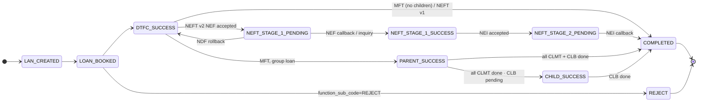

# How disbursement state works — a guided tour with code anchors

> Read this if you've never touched the disbursement code, or if you have but want one map covering business flow + code structure together. Companion: [`disbursement-engine.md`](disbursement-engine.md) for the full processor chain enumeration, [`platform/state-machine-safety.md`](../platform/state-machine-safety.md) for the CAS contract reference.

All file paths in this doc are relative to `novopay-platform-accounting-v2/src/main/java/in/novopay/accounting/`. The few orchestration XMLs sit under `novopay-platform-accounting-v2/deploy/application/orchestration/`.

---

## Product matrix — INDL / JLG / SHG (accounting `disburseLoan`)

**Child-flow gate in accounting is `member_details[]` non-empty** — not `group_details`. JLG may carry optional `group_details` on a **flat** per-member disburse with `member_details: null`.

| | **INDL** | **JLG** | **SHG** |
|---|---|---|---|
| **LOS trigger** | `DisburseLoanProcessor` | After PDC: per-member INDIVIDUAL rows; one `disburseLoan` per member | `DisburseGroupLoanProcessor` — GROUP row |
| **Payload** | Flat; no `member_details` | Flat; `member_details: null`; optional `group_details` | Parent + **`member_details[]`** (child sum = parent, 134472) |
| **`has_child_accounts`** | `false` | `false` per member LAN | `true` when product category SHG (`CreateLoanAccountProcessor:172-174`) |
| **MFT terminal** | `COMPLETED` | `COMPLETED` | `PARENT_SUCCESS` when `member_details` set (`CallBankAPIForDisbursementProcessor:357-358`) |
| **CLMT queue** | No | No | Yes (`PrepareClmtRowsForChildDisbursementProcessor:46-48`) |
| **Local sanity** | `product_id=45` | `product_id=2`, flat payload | `product_id=44`, `member_details[]` |

---

## What this doc gives you

By the end of this read you should be able to:

1. Name **every state** a `loan_account` row passes through during disbursement, and the code line that writes it
2. Trace a **single loan** end-to-end (origination → bank call → callback → COMPLETED)
3. Trace a **group loan** (parent + children, CLMT/CLB queue, parent sync)
4. Explain **why CAS** and read the SQL that enforces it
5. Walk a **bank failure** scenario and see how the system self-heals on the next retry
6. Open the right file when you need to debug a stuck loan

We use real examples — **single loan LAN 6009685525** and a **3-member SHG group** — running throughout.

---

## Part 1 — Every state, in one place

| State | Meaning | Where set (file:line) |
|---|---|---|
| `LAN_CREATED` | `loan_account` row exists; nothing posted yet | [`account/loans/processor/CreateLoanAccountProcessor.java:141`](../../novopay-platform-accounting-v2/src/main/java/in/novopay/accounting/account/loans/processor/CreateLoanAccountProcessor.java#L141) — direct `setDisbursementStatus("LAN_CREATED")` at insert time |
| `LOAN_BOOKED` | Product, schedule, charges, derived fields populated | [`custom/mfi/disburse/processor/UpdateDisbursementStatusProcessor.java:54`](../../novopay-platform-accounting-v2/src/main/java/in/novopay/accounting/custom/mfi/disburse/processor/UpdateDisbursementStatusProcessor.java#L54) — default branch; setter+save |
| `DTFC_SUCCESS` | Internal CASA debit posted (Disbursement-Through-FCC) | [`custom/mfi/disburse/processor/UpdateDisbursementStatusProcessor.java:54`](../../novopay-platform-accounting-v2/src/main/java/in/novopay/accounting/custom/mfi/disburse/processor/UpdateDisbursementStatusProcessor.java#L54) — same processor with `disbursement_status="DTFC_SUCCESS"` from EC |
| `BANK_SUCCESS` | Marker after bank call accepted (legacy MFI custom flow only) | [`UpdateDisbursementStatusProcessor.java:43`](../../novopay-platform-accounting-v2/src/main/java/in/novopay/accounting/custom/mfi/disburse/processor/UpdateDisbursementStatusProcessor.java#L43) — `case "BANK_SUCCESS"` |
| `NEFT_STAGE_1_PENDING` | NEFT v2: NEF call accepted, awaiting NEF callback | [`processor/CallBankAPIForDisbursementProcessor.java:344`](../../novopay-platform-accounting-v2/src/main/java/in/novopay/accounting/loan/disbursement/processor/CallBankAPIForDisbursementProcessor.java#L344) — CAS via `LoanAccountStateMachineService.transition` |
| `NEFT_STAGE_1_SUCCESS` | NEFT v2: NEF callback confirmed | [`processor/DoGenericSyncSTPBankNeftCallBackProcessor.java:303-310`](../../novopay-platform-accounting-v2/src/main/java/in/novopay/accounting/loan/disbursement/processor/DoGenericSyncSTPBankNeftCallBackProcessor.java#L303) — `processNEFCallback` CAS |
| `NEFT_STAGE_2_PENDING` | NEFT v2: NEI call accepted, awaiting NEI callback | [`CallBankAPIForDisbursementProcessor.java:344`](../../novopay-platform-accounting-v2/src/main/java/in/novopay/accounting/loan/disbursement/processor/CallBankAPIForDisbursementProcessor.java#L344) — same site as STAGE_1_PENDING; toState varies |
| `PARENT_SUCCESS` | Group loan: parent CASA debited; children pending | [`CallBankAPIForDisbursementProcessor.java:329-339`](../../novopay-platform-accounting-v2/src/main/java/in/novopay/accounting/loan/disbursement/processor/CallBankAPIForDisbursementProcessor.java#L329) — `!isNeft` (MFT) branch with `member_details` non-empty |
| `CHILD_SUCCESS` | Group loan: all CLMT done; CLB pending | [`grouploan/disbursement/service/ParentGroupDisbursementStatusSyncService.java:78`](../../novopay-platform-accounting-v2/src/main/java/in/novopay/accounting/loan/grouploan/disbursement/service/ParentGroupDisbursementStatusSyncService.java#L78) (legacy setter+save), [`grouploan/disbursement/processor/UpdateChildLoanDisbursementStatusProcessor.java:103`](../../novopay-platform-accounting-v2/src/main/java/in/novopay/accounting/loan/grouploan/disbursement/processor/UpdateChildLoanDisbursementStatusProcessor.java#L103) (legacy setter+save) |
| `COMPLETED` | Terminal — money is out, loan active | NEFT v2: [`DoGenericSyncSTPBankNeftCallBackProcessor.java:322-333`](../../novopay-platform-accounting-v2/src/main/java/in/novopay/accounting/loan/disbursement/processor/DoGenericSyncSTPBankNeftCallBackProcessor.java#L322) (`processNEICallback`) · NEFT v1: [`CallBankAPIForDisbursementProcessor.java:344`](../../novopay-platform-accounting-v2/src/main/java/in/novopay/accounting/loan/disbursement/processor/CallBankAPIForDisbursementProcessor.java#L344) (CAS, NEFT branch with `NEFT_STAGE_STATUS=COMPLETED`) · MFT: [`CallBankAPIForDisbursementProcessor.java:329-339`](../../novopay-platform-accounting-v2/src/main/java/in/novopay/accounting/loan/disbursement/processor/CallBankAPIForDisbursementProcessor.java#L329) (CAS) · Group sync: `ParentGroupDisbursementStatusSyncService.java:78` (legacy) |
| `REJECT` | Loan application rejected | Set by orchestration `function_sub_code=REJECT` branch in [`mfi_orc.xml:187-192`](../../novopay-platform-accounting-v2/deploy/application/orchestration/mfi_orc.xml#L187) |
| `REINITIATE_BANK` | Not a stored state — a `function_sub_code` LOS sends to drive reinit | Read by [`util/DisbursementBankCallTypeUtil.java:50`](../../novopay-platform-accounting-v2/src/main/java/in/novopay/accounting/loan/disbursement/util/DisbursementBankCallTypeUtil.java#L50) (`isNeftPaymentReinit`) |

The "where set" column shows that not every state moves through the same writer. Part 10 has the full writer map. Part 6 explains why some states skip CAS.

---

## Part 2 — The whole pipeline at a glance

```
   ┌──────────────────┐
   │   LAN_CREATED    │  loan_account row exists
   └────────┬─────────┘
            │
   ┌────────▼─────────┐
   │   LOAN_BOOKED    │  product · schedule · charges
   └────────┬─────────┘
            │             ─── REJECT path ───────┐
   ┌────────▼─────────┐                          │
   │   DTFC_SUCCESS   │  internal CASA debited   ▼
   └────────┬─────────┘                       ┌──────┐
            │                                 │REJECT│
            │ (bank call decides what's next) └──────┘
            │
   ┌────────┴────────────────────────────────────────────────┐
   │                                                         │
SINGLE LOAN (INDL / JLG per-member)                          GROUP LOAN (SHG only)
   │                                                         │
   ├── MFT lane     ┐                                  ┌── parent CASA debit (MFT or NEFT v2)
   │                │                                  │
   ├── NEFT v1 lane │                                  ├── PARENT_SUCCESS
   │                │                                  │      (parent done; children pending)
   └── NEFT v2 lane │                                  │
       (NEFT_STAGE_1_PENDING                           ├── child legs via CLMT queue
        → STAGE_1_SUCCESS                              │   (member_details[] in request)
        → STAGE_2_PENDING)                             │
                    │                                  ├── CHILD_SUCCESS
                    │                                  │      (CLMTs done; CLB still pending)
                    ▼                                  │
              ┌──────────────────┐                     │
              │    COMPLETED     │ ◄───────────────────┘
              └──────────────────┘
```

**JLG** follows the left column (flat disburse, `member_details` null). **SHG** follows the right column (`member_details[]` present). Do not treat JLG `group_details` as SHG child-flow.

### Code: how this pipeline is wired

The disburseLoan orchestration runs in [`mfi_orc.xml`](../../novopay-platform-accounting-v2/deploy/application/orchestration/mfi_orc.xml). The `function_sub_code` switch sits at line ~140-185 and routes to the populate / validate / DTFC posting / bank call / post-bank chain.

The key processors, in order:

| Processor (orchestration `bean`) | Java class | Responsibility |
|---|---|---|
| `createLoanAccountProcessor` | [`CreateLoanAccountProcessor`](../../novopay-platform-accounting-v2/src/main/java/in/novopay/accounting/account/loans/processor/CreateLoanAccountProcessor.java) | Inserts the row; sets `LAN_CREATED` |
| `updateDisbursementStatusProcessor` | [`UpdateDisbursementStatusProcessor`](../../novopay-platform-accounting-v2/src/main/java/in/novopay/accounting/custom/mfi/disburse/processor/UpdateDisbursementStatusProcessor.java) | Stamps `LOAN_BOOKED` / `DTFC_SUCCESS` / `BANK_SUCCESS` based on EC value; legacy setter+save |
| `callBankAPIForDisbursementProcessor` | [`CallBankAPIForDisbursementProcessor`](../../novopay-platform-accounting-v2/src/main/java/in/novopay/accounting/loan/disbursement/processor/CallBankAPIForDisbursementProcessor.java) | Decides MFT vs NEFT v1 vs NEFT v2; runs inquiry path for retry; finally calls `saveBankErrorResponseCode` which CAS-advances state |
| `prepareClmtRowsForChildDisbursementProcessor` | [`PrepareClmtRowsForChildDisbursementProcessor`](../../novopay-platform-accounting-v2/src/main/java/in/novopay/accounting/loan/grouploan/disbursement/processor/PrepareClmtRowsForChildDisbursementProcessor.java) | **SHG only** (`member_details[]`) — queues one CLMT row per child |
| `performChildLoanBankDisbursementProcessor` | [`PerformChildLoanBankDisbursementProcessor`](../../novopay-platform-accounting-v2/src/main/java/in/novopay/accounting/loan/disbursement/processor/PerformChildLoanBankDisbursementProcessor.java) | Group only — kicks off processing of CLMT rows |

The bank-call processor delegates lane work to:

| Lane | Bank call class (parent) | Bank call class (child) |
|---|---|---|
| MFT | [`bank/parent/ParentDisbursementMftBankCall`](../../novopay-platform-accounting-v2/src/main/java/in/novopay/accounting/loan/disbursement/bank/parent/ParentDisbursementMftBankCall.java) | [`bank/child/ChildDisbursementMftBankCall`](../../novopay-platform-accounting-v2/src/main/java/in/novopay/accounting/loan/disbursement/bank/child/ChildDisbursementMftBankCall.java) |
| NEFT v1 | [`bank/parent/ParentDisbursementNeftV1BankCall`](../../novopay-platform-accounting-v2/src/main/java/in/novopay/accounting/loan/disbursement/bank/parent/ParentDisbursementNeftV1BankCall.java) | [`bank/child/ChildDisbursementNeftV1BankCall`](../../novopay-platform-accounting-v2/src/main/java/in/novopay/accounting/loan/disbursement/bank/child/ChildDisbursementNeftV1BankCall.java) |
| NEFT v2 | [`bank/parent/ParentDisbursementNeftV2BankCall`](../../novopay-platform-accounting-v2/src/main/java/in/novopay/accounting/loan/disbursement/bank/parent/ParentDisbursementNeftV2BankCall.java) | [`bank/child/ChildDisbursementNeftV2BankCall`](../../novopay-platform-accounting-v2/src/main/java/in/novopay/accounting/loan/disbursement/bank/child/ChildDisbursementNeftV2BankCall.java) |

Async callbacks (NEFT v2 only) are handled by [`processor/DoGenericSyncSTPBankNeftCallBackProcessor`](../../novopay-platform-accounting-v2/src/main/java/in/novopay/accounting/loan/disbursement/processor/DoGenericSyncSTPBankNeftCallBackProcessor.java).

---

## Part 3 — Walking a single loan (LAN 6009685525, NEFT v2 lane)

Six row updates, top to bottom. Same row every time.

### A. Just booked

```
loan_account
┌─────────────────────┬──────────────────────┐
│ id                  │ 12345                │
│ account_number      │ 6009685525           │
│ disbursement_status │ LAN_CREATED          │   ← here
│ filler_1            │ NULL                 │
│ filler_2            │ NULL                 │
└─────────────────────┴──────────────────────┘
```

**Code**: [`CreateLoanAccountProcessor.java:141`](../../novopay-platform-accounting-v2/src/main/java/in/novopay/accounting/account/loans/processor/CreateLoanAccountProcessor.java#L141) — `loanAccountEntity.setDisbursementStatus("LAN_CREATED")` then `dao.save(entity)` (insert; safe because no concurrent writer at creation time).

### B. Booking complete → LOAN_BOOKED

`UpdateDisbursementStatusProcessor` fires after schedule + charges + derived fields populate. EC carries `disbursement_status="LOAN_BOOKED"`:

```java
// UpdateDisbursementStatusProcessor.java line 54 (default branch)
loanAccountEntity.setDisbursementStatus(disbursementStatus);
loanAccountDAOService.save(loanAccountEntity);
```

This is a legacy setter+save path — see Part 6 / Part 10 for the auto-flush gap discussion.

```
disbursement_status = LOAN_BOOKED
```

### C. Internal posting done → DTFC_SUCCESS

Internal CASA debit (parent CASA) posts via the posting engine ([`engines/posting-engine.md`](posting-engine.md) for posting flow detail). The same `UpdateDisbursementStatusProcessor` then stamps `DTFC_SUCCESS`.

```
disbursement_status = DTFC_SUCCESS
```

This is the launch pad for the bank call.

### D. NEF call accepted → NEFT_STAGE_1_PENDING

`callBankAPIForDisbursementProcessor` runs. It picks the NEFT v2 lane (mode = `OTHBACCT`, `USE_NEFT_V1=false`), calls [`ParentDisbursementNeftV2BankCall.doNEFTTransaction`](../../novopay-platform-accounting-v2/src/main/java/in/novopay/accounting/loan/disbursement/bank/parent/ParentDisbursementNeftV2BankCall.java#L72). Bank replies `replyCode=0`. Back in [`CallBankAPIForDisbursementProcessor.saveBankErrorResponseCode`](../../novopay-platform-accounting-v2/src/main/java/in/novopay/accounting/loan/disbursement/processor/CallBankAPIForDisbursementProcessor.java#L283) at line ~344, this CAS runs:

```sql
UPDATE loan_account
   SET disbursement_status = 'NEFT_STAGE_1_PENDING',
       filler_1 = COALESCE('MFI-40001', filler_1),
       filler_2 = COALESCE('NEFT ST_NEF Transaction Initiated successfully', filler_2),
       updated_on = NOW()
 WHERE account_id = 12345
   AND disbursement_status = ANY(string_to_array('DTFC_SUCCESS', ','))
```

The actual SQL lives in [`account/loans/repository/LoanAccountRepository.java:790-798`](../../novopay-platform-accounting-v2/src/main/java/in/novopay/accounting/account/loans/repository/LoanAccountRepository.java#L790) (`@Modifying @Query`). The `fromStates` CSV is built by [`service/ChildClmtTerminalStateGuard.rankBackwardSafeFromStates`](../../novopay-platform-accounting-v2/src/main/java/in/novopay/accounting/loan/disbursement/service/ChildClmtTerminalStateGuard.java#L66). The transition is dispatched by [`service/LoanAccountStateMachineService.transition`](../../novopay-platform-accounting-v2/src/main/java/in/novopay/accounting/loan/disbursement/service/LoanAccountStateMachineService.java).

A row also lands in `client_request_response_log` (CRR) for audit:

```
client_request_response_log
│ loan_account_number     │ 6009685525           │
│ transaction_type        │ ..._NEFT_NEF         │
│ status                  │ SUCCESS              │
│ client_reference_number │ 60096855250701       │
```

### E. NEF callback → NEFT_STAGE_1_SUCCESS

The bank's webhook hits us at the orchestrated `doGenericSyncSTPBankNeftCallBack` API. [`DoGenericSyncSTPBankNeftCallBackProcessor.process`](../../novopay-platform-accounting-v2/src/main/java/in/novopay/accounting/loan/disbursement/processor/DoGenericSyncSTPBankNeftCallBackProcessor.java#L84) parses the payload, splits into success / failed / in-progress, then for each success calls [`processSingleCallback`](../../novopay-platform-accounting-v2/src/main/java/in/novopay/accounting/loan/disbursement/processor/DoGenericSyncSTPBankNeftCallBackProcessor.java#L217) → [`processLoanAccount`](../../novopay-platform-accounting-v2/src/main/java/in/novopay/accounting/loan/disbursement/processor/DoGenericSyncSTPBankNeftCallBackProcessor.java#L231) → [`processNEFCallback`](../../novopay-platform-accounting-v2/src/main/java/in/novopay/accounting/loan/disbursement/processor/DoGenericSyncSTPBankNeftCallBackProcessor.java#L301):

```java
LoanAccountTransitionRequest req = LoanAccountTransitionRequest.builder()
        .accountId(loanAccountEntity.getId())
        .fromStates(NEFT_STAGE_1_PENDING, DTFC_SUCCESS)
        .toState(NEFT_STAGE_1_SUCCESS)
        .filler1(MFI_40001)
        .filler2("Waiting to initiate ST NEI - NEFT STAGE 2")
        .build();
ChildClmtTransitionResult result = loanAccountStateMachineService.transition(req);
if (result == ChildClmtTransitionResult.APPLIED) {
    // persist UTR
    LoanDisbursementModeDetailsEntity ldmd = loanDisbursementModeDetailsDAOService.findOneByLoanAccountId(...);
    ldmd.setUtrNumber(utrNumber);
    loanDisbursementModeDetailsDAOService.save(ldmd);
}
```

UTR goes into `loan_disbursement_mode_details.utr_number` (separate table — UTR is per-payment, not per-state).

### F. NEI call accepted → NEFT_STAGE_2_PENDING

Same `doNEFTTransaction` method, but the inner branch this time is `NEFT_STAGE_1_SUCCESS / NEFT_STAGE_2_PENDING` ([`ParentDisbursementNeftV2BankCall.java:94-98`](../../novopay-platform-accounting-v2/src/main/java/in/novopay/accounting/loan/disbursement/bank/parent/ParentDisbursementNeftV2BankCall.java#L94)) which fires the NEI bank API. CAS to NEFT_STAGE_2_PENDING via the same site as Step D.

### G. NEI callback → COMPLETED

[`processNEICallback:320`](../../novopay-platform-accounting-v2/src/main/java/in/novopay/accounting/loan/disbursement/processor/DoGenericSyncSTPBankNeftCallBackProcessor.java#L320):

```java
LoanAccountTransitionRequest req = LoanAccountTransitionRequest.builder()
        .accountId(loanAccountEntity.getId())
        .fromStates(NEFT_STAGE_2_PENDING, NEFT_STAGE_1_SUCCESS)
        .toState(COMPLETED)
        .filler1("")
        .filler2("")
        .build();
loanAccountStateMachineService.transition(req);
```

`COMPLETED` is the idempotent terminal — duplicate callback APPLIES (no-op).

That's the whole single-loan happy path. Six DB updates, six CAS, no race possible.

---

## Part 4 — Walking a group loan (3-member SHG)

The group has:

- **1 parent** (`loan_account` id=20000) — holds aggregate amount, owns the parent CASA
- **3 children** (`loan_account` id=20001, 20002, 20003) — one per group member
- Each child has a corresponding **CLMT row** in `loan_account_events_queue` (one per child), keyed by `parent_account_id=20000`

The CLMT row holds the child's lane state inside its `data->>'disbursement_status'` JSON path. The `loan_account_events_queue` table is also used for **CLB rows** (Child Loan Booking) which trigger the `childLoanDisbursement` API later.

- **CLMT** = Child Loan Money Transfer (the bank call queue, processed by `ChildLoanEventProcessingItemProcessor`)
- **CLB** = Child Loan Booking (the post-money-transfer step that finalises the child loan_account record)

### Step 1: parent + children booked

```
loan_account[20000] (parent)   disbursement_status = LOAN_BOOKED
loan_account[20001..20003]     disbursement_status = LOAN_BOOKED
```

### Step 2: parent CASA debited

Posting layer runs. `UpdateDisbursementStatusProcessor` stamps the parent:

```
parent.disbursement_status = DTFC_SUCCESS
```

### Step 3: parent fires bank call (MFT lane)

The bank-call processor delegates to [`ParentDisbursementMftBankCall.doMFTTransaction`](../../novopay-platform-accounting-v2/src/main/java/in/novopay/accounting/loan/disbursement/bank/parent/ParentDisbursementMftBankCall.java) — single internal transfer, `replyCode=0`.

Back in [`CallBankAPIForDisbursementProcessor.saveBankErrorResponseCode:325-339`](../../novopay-platform-accounting-v2/src/main/java/in/novopay/accounting/loan/disbursement/processor/CallBankAPIForDisbursementProcessor.java#L325) (the `!isNeft` branch), `member_details` from EC is non-empty → group loan. CAS runs:

```java
boolean hasChildren = !ListUtils.emptyIfNull(executionContext.getValue("member_details", JSONArray.class)).isEmpty();
String mftToState = hasChildren ? PARENT_SUCCESS : COMPLETED;
LoanAccountTransitionRequest req = LoanAccountTransitionRequest.builder()
        .accountId(loanAccountId)
        .fromStates(DTFC_SUCCESS)
        .toState(mftToState)
        .filler1(hasChildren ? MFI_40001 : "")
        .filler2(hasChildren ? "Parent Loan transaction completed successfully. Waiting for child loan disbursement" : "")
        .build();
loanAccountStateMachineService.transition(req);
```

```
parent.disbursement_status = PARENT_SUCCESS
```

### Step 4: CLMT rows queued for each child

[`PrepareClmtRowsForChildDisbursementProcessor`](../../novopay-platform-accounting-v2/src/main/java/in/novopay/accounting/loan/grouploan/disbursement/processor/PrepareClmtRowsForChildDisbursementProcessor.java) inserts one CLMT row per child:

```
loan_account_events_queue
┌───────┬──────────────────┬───────────┬──────────────┬────────────────────────────────────────┐
│ id    │ parent_account_id│ event_type│ event_status │ data (JSONB)                           │
├───────┼──────────────────┼───────────┼──────────────┼────────────────────────────────────────┤
│ 31001 │ 20000            │ CLMT      │ P (pending)  │ {"disbursement_status":"DTFC_SUCCESS"} │
│ 31002 │ 20000            │ CLMT      │ P            │ {"disbursement_status":"DTFC_SUCCESS"} │
│ 31003 │ 20000            │ CLMT      │ P            │ {"disbursement_status":"DTFC_SUCCESS"} │
└───────┴──────────────────┴───────────┴──────────────┴────────────────────────────────────────┘
```

The state machine for each CLMT row uses the **same constants** but writes via [`service/ChildClmtStateMachineService`](../../novopay-platform-accounting-v2/src/main/java/in/novopay/accounting/loan/disbursement/service/ChildClmtStateMachineService.java), which CASes the JSON path inside `data` (not the table column). The repository CAS UPDATE is a JSON-aware UPDATE on `loan_account_events_queue.data`.

### Step 5: each child CLMT row processes (via CLMT batch consumer or in-line)

For NEFT v2 SHG, each child fires its own NEFT call (parent CASA → child member's account). The processor for each CLMT row is [`processor/CallBankAPIForIndividualChildLoanDisbursementProcessor`](../../novopay-platform-accounting-v2/src/main/java/in/novopay/accounting/loan/disbursement/processor/CallBankAPIForIndividualChildLoanDisbursementProcessor.java), which calls into [`bank/child/ChildDisbursementBankCallService`](../../novopay-platform-accounting-v2/src/main/java/in/novopay/accounting/loan/disbursement/bank/child/ChildDisbursementBankCallService.java).

Per child, the CLMT row's `data->>'disbursement_status'` walks:

```
DTFC_SUCCESS → NEFT_STAGE_1_PENDING → NEFT_STAGE_1_SUCCESS
            → NEFT_STAGE_2_PENDING → COMPLETED
```

Each transition is a `ChildClmtStateMachineService.transition` CAS on the JSON path. Same forward-only rank semantics as the parent's column.

When a CLMT row reaches COMPLETED, its `event_status` flips from `P` to `C` (completed). Source: [`PostNEFTChildLoanBankDisbursementProcessor`](../../novopay-platform-accounting-v2/src/main/java/in/novopay/accounting/loan/disbursement/processor/PostNEFTChildLoanBankDisbursementProcessor.java) (NEFT) and [`PostMFTChildLoanBankDisbursementProcessor`](../../novopay-platform-accounting-v2/src/main/java/in/novopay/accounting/loan/disbursement/processor/PostMFTChildLoanBankDisbursementProcessor.java) (MFT).

### Step 6: when all CLMTs done → parent advances

Every successful CLMT advance triggers [`ParentGroupDisbursementStatusSyncService.syncParentAfterChildQueueProgress`](../../novopay-platform-accounting-v2/src/main/java/in/novopay/accounting/loan/grouploan/disbursement/service/ParentGroupDisbursementStatusSyncService.java#L40):

```java
// 1. Read all CLMT rows for the parent
List<LoanAccountEventsQueueEntity> clmt = ...findAllByParentAccountIdAndEventType(parentId, CLMT);
// 2. If not all are event_status=C, no-op
long done = clmt.stream().filter(e -> e.getEventStatus() == "C").count();
if (done != clmt.size()) return;

// 3. Check parent's current state
String cur = parent.getDisbursementStatus();
if (!PARENT_SUCCESS.equalsIgnoreCase(cur) && !CHILD_SUCCESS.equalsIgnoreCase(cur)) return;

// 4. Look at CLB rows
List<LoanAccountEventsQueueEntity> pendingClb = ...findAllByParentIdEventAndEventStatus(parentId, CLB, P);
String target = pendingClb.isEmpty() ? COMPLETED : CHILD_SUCCESS;

// 5. Setter+save (legacy — see Part 10)
parent.setDisbursementStatus(target);
loanAccountDAOService.save(parent);
```

`CHILD_SUCCESS` means: **all child money transfers done; child loan booking events still in flight**. Once CLB rows finish too, another caller (`UpdateChildLoanDisbursementStatusProcessor`) flips parent to `COMPLETED`.

### Group flow at a glance

```
parent: LAN_CREATED → LOAN_BOOKED → DTFC_SUCCESS
              │
              ▼
    ┌───────────────────────┐
    │      PARENT_SUCCESS   │  ◄── parent CASA debit done; children kicked off
    └───────────┬───────────┘
                │
    each child CLMT row walks its own state machine
    (per-child CAS on data->>'disbursement_status')
                │
                ▼
    ┌───────────────────────────────────┐
    │ syncParentAfterChildQueueProgress │  fires after each CLMT advance;
    │ waits for all CLMT event_status=C │  no-op until all complete
    └───────────┬───────────────────────┘
                │
   ┌────────────┴────────────┐
   │ CLB rows still pending? │
   ├──── yes ────┐    ├──── no ────┐
   │             ▼    │            ▼
   │     CHILD_SUCCESS         COMPLETED
   │             │
   │   (CLBs finish via UpdateChildLoanDisbursementStatusProcessor)
   │             ▼
   │         COMPLETED
```

---

## Part 5 — Why CAS? A race demo

Same demo as a single loan would face, but the same logic applies to every transition above.

### The naive bug

Two threads racing on parent `loan_account[20000]`:

| Time | Thread A (Kafka redelivery of disburseLoan) | Thread B (NEF callback for the parent) |
|---|---|---|
| t=0 | Reads row: `state = DTFC_SUCCESS` | |
| t=1 | | Reads row: `state = DTFC_SUCCESS` |
| t=2 | Decides "fire NEF" | |
| t=3 | | Decides "advance to NEFT_STAGE_1_SUCCESS" |
| t=4 | `UPDATE loan_account SET state='NEFT_STAGE_1_PENDING' WHERE id=20000` ✓ | |
| t=5 | | `UPDATE loan_account SET state='NEFT_STAGE_1_SUCCESS' WHERE id=20000` ✓ |
| t=6 | Hibernate auto-flushes A's stale entity → UPDATE row back to `NEFT_STAGE_1_PENDING` — **clobbering B's success** | |

Customer sees stuck loan; bank actually paid out.

### CAS fixes it

Same race, every UPDATE has the `WHERE current IN (allowed_previous)` guard:

| Time | Thread A | Thread B |
|---|---|---|
| t=4 | `UPDATE … WHERE state IN ('DTFC_SUCCESS')` → match → APPLIED | |
| t=5 | | `UPDATE … WHERE state IN ('DTFC_SUCCESS','NEFT_STAGE_1_PENDING')` → match → APPLIED |
| t=6 | A's auto-flush UPDATE has `WHERE state IN ('DTFC_SUCCESS')` → state is now `NEFT_STAGE_1_SUCCESS` → 0 rows → REJECTED | |

### Where the SQL is

Single source of truth: [`account/loans/repository/LoanAccountRepository.java:787-808`](../../novopay-platform-accounting-v2/src/main/java/in/novopay/accounting/account/loans/repository/LoanAccountRepository.java#L787) for `loan_account.disbursement_status`:

```java
@Modifying
@Query(nativeQuery = true, value =
        " UPDATE loan_account " +
        "    SET disbursement_status = :toState, " +
        "        filler_1 = COALESCE(:filler1, filler_1), " +
        "        filler_2 = COALESCE(:filler2, filler_2), " +
        "        filler_4 = COALESCE(:filler4, filler_4), " +
        "        updated_on = :now, " +
        "        updated_by = COALESCE(:updatedBy, updated_by) " +
        "  WHERE account_id = :id " +
        "    AND disbursement_status = ANY(string_to_array(:fromStatesCsv, ','))")
int conditionalUpdateLoanAccountState(...);
```

The CSV is built by [`ChildClmtTerminalStateGuard.rankBackwardSafeFromStates`](../../novopay-platform-accounting-v2/src/main/java/in/novopay/accounting/loan/disbursement/service/ChildClmtTerminalStateGuard.java#L66) and converted to a comma-joined string in [`LoanAccountStateMachineService.transition`](../../novopay-platform-accounting-v2/src/main/java/in/novopay/accounting/loan/disbursement/service/LoanAccountStateMachineService.java#L26).

For CLMT row JSON state: [`service/ChildClmtStateMachineService`](../../novopay-platform-accounting-v2/src/main/java/in/novopay/accounting/loan/disbursement/service/ChildClmtStateMachineService.java) — same CAS shape, but the WHERE clause keys off the JSON path inside `data`.

For reinit: [`service/PaymentReinitiationStateService.transition`](../../novopay-platform-accounting-v2/src/main/java/in/novopay/accounting/loan/disbursement/service/PaymentReinitiationStateService.java) — CASes `loan_account.reinit_disbursement_status` (V000189 column).

---

## Part 6 — How CAS works, layer by layer

This is the deep-dive section. If you're making a video walkthrough, each subsection below is a "scene" — start at 6.1 and follow the call all the way to the DB and back.

### 6.1 The five layers a transition crosses

Every state advance — happy path NEFT v2 stage, MFT completion, NDF rollback — flows through the same five layers:

```
┌─────────────────────────────────────────────────────────────┐
│ Layer 1 — Caller (a processor or callback handler)          │
│   • Decides what toState should be                          │
│   • Decides what fillers to set (or leave null)             │
│   • Calls into the state-machine service                    │
└───────────────────────────────┬─────────────────────────────┘
                                │ method call
                                ▼
┌─────────────────────────────────────────────────────────────┐
│ Layer 2 — State-machine service                             │
│   LoanAccountStateMachineService / ChildClmtStateMachineSvc │
│   PaymentReinitiationStateService                           │
│   • @Transactional(REQUIRES_NEW) — opens a fresh tx         │
│   • Joins the request's fromStates set into a CSV string    │
│   • Calls the DAO with (id, csv, toState, fillers, now, by) │
└───────────────────────────────┬─────────────────────────────┘
                                │ method call
                                ▼
┌─────────────────────────────────────────────────────────────┐
│ Layer 3 — DAO service                                       │
│   LoanAccountDAOService                                     │
│   • Plain delegate to the JPA repository                    │
│   • No business logic; exists for spring-bean wiring        │
└───────────────────────────────┬─────────────────────────────┘
                                │ method call
                                ▼
┌─────────────────────────────────────────────────────────────┐
│ Layer 4 — Repository (Spring Data JPA)                      │
│   LoanAccountRepository                                     │
│   • @Modifying @Query annotated method                      │
│   • Defines the native SQL UPDATE                           │
│   • Returns int (rows updated)                              │
└───────────────────────────────┬─────────────────────────────┘
                                │ JDBC
                                ▼
┌─────────────────────────────────────────────────────────────┐
│ Layer 5 — Postgres / Yugabyte                               │
│   • Evaluates WHERE clause against the row                  │
│   • If matches: UPDATE proceeds, returns 1                  │
│   • If no match: returns 0 (race lost — REJECTED)           │
└─────────────────────────────────────────────────────────────┘
```

Each subsection below zooms into one layer.

### 6.2 Layer 1 — the caller decides

A typical caller looks like this (NEF callback handler):

```java
// DoGenericSyncSTPBankNeftCallBackProcessor.processNEFCallback (line 301-318)
LoanAccountTransitionRequest req = LoanAccountTransitionRequest.builder()
        .accountId(loanAccountEntity.getId())
        .fromStates(NEFT_STAGE_1_PENDING, DTFC_SUCCESS)  // (1)
        .toState(NEFT_STAGE_1_SUCCESS)                   // (2)
        .filler1(MFI_40001)                              // (3)
        .filler2("Waiting to initiate ST NEI - NEFT STAGE 2")
        .build();
ChildClmtTransitionResult result = loanAccountStateMachineService.transition(req);
if (result == ChildClmtTransitionResult.APPLIED) {        // (4)
    // also persist UTR (separate table)
    LoanDisbursementModeDetailsEntity ldmd = ...;
    ldmd.setUtrNumber(utrNumber);
    loanDisbursementModeDetailsDAOService.save(ldmd);
} else {
    LOG.error("Loan Account with account number {} already updated with NEFT STAGE 1 SUCCESS", ...);
}
```

The four caller decisions:

1. **`fromStates`**: "I'll only advance the row if it's currently in one of these states." For a NEF callback, valid prior states are `DTFC_SUCCESS` (we're racing the bank-call processor) or `NEFT_STAGE_1_PENDING` (the bank-call processor already CAS'd). If the row is at `NEFT_STAGE_1_SUCCESS` (callback duplicate), `NEFT_STAGE_2_PENDING` or beyond, the callback REJECTS and skips.
2. **`toState`**: where to advance to.
3. **`filler1`/`filler2`**: optional patches. The CAS UPDATE wraps these in `COALESCE(:filler1, filler_1)` so passing `null` means "leave column alone".
4. **Reaction to result**: APPLIED → side-effect (persist UTR); REJECTED → log and skip (someone else won).

For the bank-call success path (Step D in Part 3), the caller is `CallBankAPIForDisbursementProcessor.saveBankErrorResponseCode` (line 304-348). Same shape, different fromStates derived from rank — see 6.6.

### 6.3 Layer 2 — the state-machine service

```java
// LoanAccountStateMachineService.transition (line 26-43)
@Transactional(propagation = Propagation.REQUIRES_NEW)
public ChildClmtTransitionResult transition(LoanAccountTransitionRequest request) {
    String fromStatesCsv = request.getFromStates().stream()
                                  .collect(Collectors.joining(","));
    int updated = loanAccountDAOService.conditionalUpdateLoanAccountState(
            request.getAccountId(),
            fromStatesCsv,
            request.getToState(),
            request.getFiller1(),
            request.getFiller2(),
            request.getFiller4(),
            new Date(),
            request.getUpdatedBy());
    if (updated > 0) {
        return ChildClmtTransitionResult.APPLIED;
    }
    LOGGER.info("loan_account transition REJECTED — accountId {} no longer in {} (intended {})",
            request.getAccountId(), request.getFromStates(), request.getToState());
    return ChildClmtTransitionResult.REJECTED;
}
```

Two things this layer does that are critical:

#### Why `@Transactional(propagation = REQUIRES_NEW)`

Disbursement orchestrations have **outer transactions** (the `disburseLoan` request's overall tx) and **inner transactions** (this CAS). `REQUIRES_NEW` says: "ignore the outer tx; open a fresh tx, do my UPDATE, commit immediately, return."

Why it matters:

- The outer `disburseLoan` tx has the entity loaded into Hibernate's persistence context. If the CAS happened **inside** the outer tx, Hibernate would see "the entity I have in memory has `disbursement_status='DTFC_SUCCESS'` but the row in the DB now says `'NEFT_STAGE_1_SUCCESS'`". On outer-tx commit, Hibernate would auto-flush and overwrite the row back to `'DTFC_SUCCESS'` — **clobbering the CAS**.
- With `REQUIRES_NEW`, the CAS runs in its own tx + its own connection. The UPDATE goes straight to the DB, commits, releases. The outer tx's Hibernate context still has the stale entity, but as long as the caller doesn't touch the entity afterward, the auto-flush never tries to write the stale state.

This is exactly why CLAUDE.md hard rule §3 says **don't call setters on the entity after a CAS APPLIED**. If you do, the outer-tx auto-flush will issue a non-CAS UPDATE that overwrites the row to whatever the in-memory entity says — a silent stomp.

The bug that motivated this rule (commit `4c339282f`) was a sync post-handler doing `entity.setSomething(x)` after `transition(req)` returned APPLIED. The outer tx auto-flushed and reverted later async-callback writes. Fixed by removing the setter; the rule encodes the lesson.

#### Why CSV joining

The DAO method takes a `String fromStatesCsv`. Why a CSV? Because the SQL uses Postgres's `string_to_array(:fromStatesCsv, ',')` to convert it to a `text[]`, which `ANY(...)` can then match against. This is just one way to pass a variable-length list of strings to a native SQL `IN` predicate without dynamic SQL or named-param expansion. See 6.5 for the SQL.

### 6.4 Layer 3 — the DAO service (delegate)

```java
// LoanAccountDAOService.conditionalUpdateLoanAccountState
public int conditionalUpdateLoanAccountState(Long id, String fromStatesCsv, String toState,
        String filler1, String filler2, String filler4, java.util.Date now, String updatedBy) {
    return loanAccountRepository.conditionalUpdateLoanAccountState(id, fromStatesCsv, toState,
            filler1, filler2, filler4, now, updatedBy);
}
```

No logic. Pure pass-through to the repository. Exists because the rest of the codebase wires Spring beans to DAO services, not raw repositories. Not interesting on its own — but useful to know it's there so when you're tracing in the debugger you don't get lost wondering why `transition` is calling a DAO.

### 6.5 Layer 4 — the repository: the SQL itself

This is the heart of the CAS. The native SQL lives in [`account/loans/repository/LoanAccountRepository.java:787-808`](../../novopay-platform-accounting-v2/src/main/java/in/novopay/accounting/account/loans/repository/LoanAccountRepository.java#L787):

```java
@Modifying
@Query(nativeQuery = true, value =
        " UPDATE loan_account " +
        "    SET disbursement_status = :toState, " +
        "        filler_1 = COALESCE(:filler1, filler_1), " +
        "        filler_2 = COALESCE(:filler2, filler_2), " +
        "        filler_4 = COALESCE(:filler4, filler_4), " +
        "        updated_on = :now, " +
        "        updated_by = COALESCE(:updatedBy, updated_by) " +
        "  WHERE account_id = :id " +
        "    AND disbursement_status = ANY(string_to_array(:fromStatesCsv, ','))")
int conditionalUpdateLoanAccountState(
        @Param("id") Long id,
        @Param("fromStatesCsv") String fromStatesCsv,
        @Param("toState") String toState,
        @Param("filler1") String filler1,
        @Param("filler2") String filler2,
        @Param("filler4") String filler4,
        @Param("now") Date now,
        @Param("updatedBy") String updatedBy);
```

Walking the SQL clause by clause:

| Clause | Purpose |
|---|---|
| `@Modifying` | Tells Spring Data JPA "this is a write, not a read" — without it, JPA would treat the method as a query and try to map a result set |
| `nativeQuery = true` | Bypass JPQL; use raw Postgres SQL. Necessary for `ANY(string_to_array(...))` which isn't a JPQL feature |
| `UPDATE loan_account` | The table |
| `SET disbursement_status = :toState` | The state advance |
| `filler_1 = COALESCE(:filler1, filler_1)` | If caller passed null, leave column alone; otherwise overwrite. Key for "patch only what's specified" |
| `filler_2 = COALESCE(:filler2, filler_2)` | Same |
| `filler_4 = COALESCE(:filler4, filler_4)` | Same |
| `updated_on = :now` | Bump the timestamp. Note: not `NOW()` — the value is supplied by the caller (`new Date()`) for testability |
| `updated_by = COALESCE(:updatedBy, updated_by)` | Audit field, only updated if caller specifies |
| `WHERE account_id = :id` | Target this specific row |
| `AND disbursement_status = ANY(string_to_array(:fromStatesCsv, ','))` | **The CAS guard.** If the row's current `disbursement_status` isn't in the comma-separated list, no match → 0 rows updated → REJECTED |

The function returns `int` — the number of rows affected by the UPDATE. Which is either 0 (no match) or 1 (match). The state-machine service in Layer 2 reads this to decide APPLIED vs REJECTED.

#### What `ANY(string_to_array(...))` does in Postgres

`string_to_array('DTFC_SUCCESS,NEFT_STAGE_1_PENDING', ',')` produces the `text[]` `{DTFC_SUCCESS, NEFT_STAGE_1_PENDING}`. Then `disbursement_status = ANY({...})` is true if the column's value matches any element of the array. It's equivalent to `disbursement_status IN ('DTFC_SUCCESS','NEFT_STAGE_1_PENDING')` but built from a runtime string instead of a literal IN-list.

#### CLMT-row CAS — the same shape, different table + JSON path

For child loans (CLMT rows in `loan_account_events_queue`), the analogous CAS is in [`ChildClmtStateMachineService`](../../novopay-platform-accounting-v2/src/main/java/in/novopay/accounting/loan/disbursement/service/ChildClmtStateMachineService.java) → repository. Same `@Modifying @Query`, but the WHERE clause uses `data->>'disbursement_status'` instead of `disbursement_status`, and `SET data = jsonb_set(data, '{disbursement_status}', ...)` instead of a column SET.

### 6.6 How the `fromStates` set is computed

The caller doesn't usually hardcode `fromStates`. It uses [`ChildClmtTerminalStateGuard.rankBackwardSafeFromStates(toState)`](../../novopay-platform-accounting-v2/src/main/java/in/novopay/accounting/loan/disbursement/service/ChildClmtTerminalStateGuard.java#L66):

```java
private static final Map<String, Integer> DISBURSEMENT_STATUS_RANK = Map.of(
        DTFC_SUCCESS, 1,
        NEFT_STAGE_1_PENDING, 2,
        NEFT_STAGE_1_SUCCESS, 3,
        NEFT_STAGE_2_PENDING, 4,
        COMPLETED, 5);

public static Set<String> rankBackwardSafeFromStates(String toState) {
    if (StringUtils.isBlank(toState)) {
        return Set.of();
    }
    String upper = toState.toUpperCase().trim();
    if (COMPLETED.equalsIgnoreCase(upper)) {
        return DISBURSEMENT_STATUS_RANK.keySet();   // (a)
    }
    Integer targetRank = DISBURSEMENT_STATUS_RANK.get(upper);
    if (targetRank == null) {
        return Set.of();                            // (b)
    }
    return DISBURSEMENT_STATUS_RANK.entrySet().stream()
            .filter(e -> e.getValue() < targetRank) // (c)
            .map(Map.Entry::getKey)
            .collect(Collectors.toUnmodifiableSet());
}
```

Three branches:

(a) **`toState == COMPLETED`** → returns **all** keys including COMPLETED itself. This is the "idempotent terminal" rule — duplicate completion APPLIES (no-op) instead of REJECTING. Useful when callbacks arrive twice.

(b) **`toState` not in the rank map** → returns empty set. Caller sees an empty `fromStates` and the CAS would reject (no match possible). This is **deliberately defensive** — see Part 7's NDF empty-fromStates story for the rollback path that uses the empty signal as a trigger.

(c) **Normal case** → returns all rank keys *strictly below* `toState`. For `toState=NEFT_STAGE_2_PENDING` (rank 4), returns `{DTFC_SUCCESS, NEFT_STAGE_1_PENDING, NEFT_STAGE_1_SUCCESS}`. The CAS will match if the row is currently in any of those three.

### 6.7 Layer 5 — Postgres evaluating the WHERE

When the UPDATE reaches Postgres:

```
1. Lock the row at account_id = 12345  (row-level FOR UPDATE inside this UPDATE)
2. Read its current disbursement_status
3. Evaluate: disbursement_status = ANY(string_to_array('DTFC_SUCCESS,NEFT_STAGE_1_PENDING', ','))
4. If true:  apply SET clause, increment xmin (MVCC), return rows-updated = 1
5. If false: skip, return rows-updated = 0
6. Release the lock at commit
```

Because the row lock is held for the duration of the UPDATE (and committed via REQUIRES_NEW immediately), two concurrent CAS attempts serialise: the first to acquire the lock evaluates the WHERE, possibly UPDATEs, commits. The second waits, then evaluates against the *new* row state, finds the WHERE doesn't match, returns 0.

**The race in Part 5 is closed at this layer.** The WHERE evaluation happens against the freshly-committed row, not against any thread's stale snapshot.

### 6.8 What "REJECTED" means for callers

A REJECTED CAS is **expected operation, not an error**. Concretely it means: "Someone else won the race; I should skip my side-effect." Common reasons:

- Callback arrived twice (network retry from bank); first one APPLIED, second REJECTS
- Async callback raced with sync inquiry; one wins, the other REJECTS
- The retry of a stale request landed after a fresh one already advanced the state

Callers handle REJECTED by:

- **Logging at INFO** (this is normal, not a bug). Example from `processNEFCallback`:
  ```java
  } else {
      LOG.error("Loan Account with account number {} already updated with NEFT STAGE 1 SUCCESS", ...);
  }
  ```
  (The `LOG.error` here is misleading — it's not actually an error. Convention from older code.)
- **Skipping the side-effect** that should only run on APPLIED. UTR persistence is the canonical example — only persist UTR if our callback was the one that advanced the state.
- **Not retrying** the CAS. The retry would just REJECT again (state is already past us).

### 6.9 The auto-flush race — the bug that wrote this rule

Before commit `4c339282f` (2026-05-07), some sync post-handlers did this:

```java
// BAD: don't do this
ChildClmtTransitionResult result = childClmtStateMachineService.transition(req);
if (result == APPLIED) {
    loanAccountEventsQueueEntity.setSomeField("...");  // ← in-memory mutation
    // (fall through; outer tx will auto-flush)
}
```

What happened operationally:

1. CAS APPLIED — DB is now at `NEFT_STAGE_1_SUCCESS`.
2. Caller mutates the in-memory entity's `someField`. Hibernate's dirty-checking notes the change.
3. Async NEI callback arrives in a different thread → CAS APPLIED → DB is now at `NEFT_STAGE_2_PENDING`.
4. The outer `disburseLoan` request's transaction commits.
5. Hibernate auto-flushes — issues a plain `UPDATE loan_account SET disbursement_status='NEFT_STAGE_1_SUCCESS', filler_1='...', filler_2='...', someField='...' WHERE id=12345 AND xmin=<old>`.
6. **The UPDATE matches** (xmin guard isn't enabled by default; entity was loaded *before* the CAS). The row reverts from `NEFT_STAGE_2_PENDING` to `NEFT_STAGE_1_SUCCESS`. The async callback's progress is lost.
7. Customer sees a stuck loan; bank actually paid out.

The fix was to **remove the in-memory mutation entirely**. If you need to write `someField`, do it through `patchJsonFields` (a separate CAS) or through the next `transition` call's filler params. Never via setters after a CAS.

This is encoded in CLAUDE.md hard rule §3 and reinforced by the `state-machine-safety` skill.

---

## Part 7 — Forward-only enforcement (and where it doesn't apply)

The state machine has a rank map. Only states in the rank map participate in CAS-based `rankBackwardSafeFromStates`:

| State | In rank map? | Rank | How writes happen |
|---|---|---|---|
| `LAN_CREATED` | ❌ | – | Insert at row creation, never advances back here |
| `LOAN_BOOKED` | ❌ | – | Setter + save (`UpdateDisbursementStatusProcessor:54`) |
| `BANK_SUCCESS` | ❌ | – | Setter + save (`UpdateDisbursementStatusProcessor:43`, legacy MFI flow) |
| `DTFC_SUCCESS` | ✅ | 1 | CAS via `LoanAccountStateMachineService.transition` |
| `NEFT_STAGE_1_PENDING` | ✅ | 2 | CAS |
| `NEFT_STAGE_1_SUCCESS` | ✅ | 3 | CAS |
| `NEFT_STAGE_2_PENDING` | ✅ | 4 | CAS |
| `COMPLETED` | ✅ | 5 (idempotent terminal) | CAS — also reachable from outside the rank map via setter+save in group sync |
| `PARENT_SUCCESS` | ❌ | – | CAS via explicit `fromStates=[DTFC_SUCCESS]` in `saveBankErrorResponseCode:325` (post-`3e8710f97`) |
| `CHILD_SUCCESS` | ❌ | – | Setter + save (`ParentGroupDisbursementStatusSyncService:78`, `UpdateChildLoanDisbursementStatusProcessor:103`) |
| `REJECT` | ❌ | – | Setter + save (REJECT branch in orchestration) |

Rank map source: [`ChildClmtTerminalStateGuard:29-34`](../../novopay-platform-accounting-v2/src/main/java/in/novopay/accounting/loan/disbursement/service/ChildClmtTerminalStateGuard.java#L29).

**The origination prefix** writes (`LAN_CREATED`, `LOAN_BOOKED`, `BANK_SUCCESS`) are safe because they happen at insert time / before any concurrent writers can race on the row. **The group sync writes** (`UpdateChildLoanDisbursementStatusProcessor`, `ParentGroupDisbursementStatusSyncService`) **do** have a theoretical auto-flush race window — flagged as a known item in Part 10; not yet refactored.

### The one allowed backward move

`NEFT_STAGE_1_PENDING → DTFC_SUCCESS`, used only when the bank's inquiry returns "batch not found" (NDF). Implementation uses an explicit `fromStates=[NEFT_STAGE_1_PENDING]` so a callback that already advanced will REJECT the rollback — race-safe.

**For parent loans**: [`CallBankAPIForDisbursementProcessor.saveBankErrorResponseCode:312-330`](../../novopay-platform-accounting-v2/src/main/java/in/novopay/accounting/loan/disbursement/processor/CallBankAPIForDisbursementProcessor.java#L312) (NEFT branch, when `validFromStates.isEmpty()` and `neftStageStatus=DTFC_SUCCESS`).

**For child CLMT rows**: same pattern, different file. See Part 7's "Child NDF" subsection.

---

## Part 8 — Bank API failure modes and replay handling

This section is the failure-mode atlas. Every realistic way a bank call (or its callback) can fail, what we record, what state remains, and exactly what the next `disburseLoan` re-trigger does to advance the flow. The driving principle everywhere: **state only advances on confirmed success**. If we don't have confirmation, the row stays where it is and the next attempt picks up.

### 8.1 Failure-mode catalog

| # | Failure | Source | What we know | State move | CRR row | Next replay |
|---|---|---|---|---|---|---|
| 1 | Connection refused / DNS failure | HTTP couldn't reach the bank | Definitely didn't process | None | FAIL | re-fire same call; safe |
| 2 | Connect timeout | Network layer | **Uncertain** (bank may have started) | None | UNKNOWN | inquiry on next attempt resolves |
| 3 | Read timeout (no response within SLA) | Network layer | **Uncertain** | None | UNKNOWN | inquiry resolves |
| 4 | TLS / SSL peer-not-verified | TLS layer | Didn't process | None | FAIL | re-fire after fixing TLS |
| 5 | HTTP 4xx | Bank rejected our request structurally | Didn't process | None | FAIL with bank body | re-fire with corrected request |
| 6 | HTTP 5xx | Bank server error | Could be either; classified by uncertainty heuristic | None | UNKNOWN if uncertain, else FAIL | inquiry on next attempt |
| 7 | HTTP 200 + `replyCode != 0` | Bank explicitly rejected at app layer | Didn't process | None — fillers capture error | FAIL | re-fire (counter advances ref) |
| 8 | HTTP 200 + parser NPE (NDF) | Response shape unexpected; raw says "batch not found" | Bank doesn't know about this txn | If NDF detected → **rollback** `NEFT_STAGE_1_PENDING → DTFC_SUCCESS` | FAIL with raw body | next replay re-fires NEF from DTFC_SUCCESS |
| 9 | NEF accepted, callback never arrives | Async — bank's webhook never reached us | In flight; unknown final outcome | None initially | NEF SUCCESS persisted | inquiry on next replay → resolves to SUCCESS / NDF |
| 10 | Callback `codstatus=R` (rejected) | Bank rejected after accepting | Bank rejected the txn | Same-state CAS writes error fillers | (callback CRR if persisted) | next replay's inquiry may NDF-rollback or stay |
| 11 | Callback `codstatus=N` (in-progress at NPCI) | NPCI says "still processing" | Likely will succeed | Forward CAS to COMPLETED (legacy heuristic) | (callback CRR) | rare; if it later flips to R, next callback handles |
| 12 | Callback `codstatus=Z` (failure) | Bank says failed | Failed | Same-state CAS writes error fillers | (callback CRR) | NDF inquiry / re-init |
| 13 | Crash mid-flow (after ACK, before CAS) | Our process died between bank reply and DB | Uncertain | Whatever was last persisted | SUCCESS at HTTP if logged before crash, else none | inquiry on next replay; idempotent |
| 14 | Inquiry returns "PROCESSED + replyCode=0" but no payment list | Edge case | Bank says we passed but no payment record | Existing handler routes; depends on path | FAIL | re-fire from DTFC_SUCCESS |
| 15 | One child CLMT fails | Per-child bank call | One child stuck; siblings unaffected | None on parent; CLMT row stays at last good state | per-child CRR FAIL/UNKNOWN | next replay's CLMT batch picks up the failed CLMT |

### 8.2 Walked-through failure scenarios

#### 8.2.1 Connection refused / network down (failure #1)

```
t=0  ParentDisbursementNeftV2BankCall.doNEFTTransaction → neftPaymentV2(executionContext)
t=1  HTTP layer throws ConnectException (DNS unresolved or TCP RST)
t=2  ParentDisbursementBankCallService.handleDisbursementBankCallTryFailure runs:
       - LOGGER.error("Error while calling Bank API during disbursement", e)
       - put(IS_BANK_CALL_FAILED, TRUE)
       - put(EXTERNAL_ERROR_CODE, MFI_40001)
       - put(EXTERNAL_ERROR_MESSAGE, e.getMessage())
       - DisbursementBankCallUncertainty.isUncertainBankOutcome(e)
           → ConnectException is NOT in the uncertain set → returns false
       - logStatus = FAIL (not UNKNOWN)
       - bankCrrLogHelper.persistBankOrInquiryLegLog(... status=FAIL ...)
t=3  saveBankErrorResponseCode runs. IS_BANK_CALL_FAILED=TRUE branch:
       loanAccountEntity.setFiller1(externalResponseCode);
       loanAccountEntity.setFiller2(externalResponseMessage);
       loanAccountDAOService.save(loanAccountEntity);
t=4  Loan stays at DTFC_SUCCESS. filler_1='MFI-40001', filler_2='Connection refused...'
```

**Next replay**:

```
1. disburseLoan re-triggers (any fsc).
2. CallBankAPIForDisbursementProcessor.process() runs.
3. Inquiry path (line 114-130): findLatestBankCrrForInquiry returns the FAIL CRR.
4. doStatusInquiry("NEFT", failedCrr) → performNEFTTransactionInquiry.
5. disbursement_status = DTFC_SUCCESS → performNeftV2InquiryWhenNotStage1Pending.
6. With our recent fix, DTFC_SUCCESS branch sets DO_TRANSACTION=TRUE.
7. Bank call (NEF) fires fresh with a new external_ref (counter incremented).
8. If bank reachable now → replyCode=0 → CAS DTFC_SUCCESS → NEFT_STAGE_1_PENDING.
9. Normal flow continues.
```

#### 8.2.2 Connect / read timeout — UNCERTAIN (failures #2, #3)

```
t=0  doNEFTTransaction makes the HTTP call.
t=1  SocketTimeoutException after the configured read timeout.
       (Could be: bank never received the request OR bank received but didn't ack OR
        bank received, processed, replied — but reply didn't reach us.)
t=2  handleDisbursementBankCallTryFailure runs.
     DisbursementBankCallUncertainty.isUncertainBankOutcome(e):
       SocketTimeoutException → true → isUncertain=TRUE
     isMftOrNeftDisbursementBankLogContext("NEFT_NEF") → true
     logStatus = UNKNOWN  (not FAIL!)
     persistBankOrInquiryLegLog(... status=UNKNOWN ...)
t=3  saveBankErrorResponseCode IS_BANK_CALL_FAILED=TRUE branch.
     filler_1 / filler_2 set. State stays DTFC_SUCCESS.
```

**Next replay** — this is where the inquiry path earns its keep:

```
1. CallBankAPIForDisbursementProcessor.process() runs.
2. findLatestBankCrrForInquiry finds the UNKNOWN CRR (matched against NEFT_NEF type).
3. doStatusInquiry("NEFT", unknownCrr) → ParentDisbursementNeftV2BankCall
       .performNEFTTransactionInquiry → performNeftV2InquiryWhenNotStage1Pending
       (state is still DTFC_SUCCESS since CAS never ran).
4. Inquiry hits the bank with the original external_ref:
     POST /GenericSyncSTPInq/.../doGenericSyncSTPInquiry
       <batchnumext>{originalRef}</batchnumext>
       <idtxn>ST_NEF</idtxn>
5. Three outcomes possible:
     a. Bank says "yes, we processed, here's the payment" with replyCode=0
        → performNeftV2InquiryWhenStage1Pending success branch (line 211-219)
        → DISBURSEMENT_STATUS=NEFT_STAGE_1_SUCCESS in EC, DO_TRANSACTION=TRUE
        → next bank call fires NEI; CAS advances state.
        → UTR persisted from the inquiry response.
     b. Bank says NDF / batch-not-found
        → NDF detection in catch block sets EC for rollback
        → saveBankErrorResponseCode rollback CAS (NEFT_STAGE_1_PENDING → DTFC_SUCCESS)
        → wait, state was DTFC_SUCCESS already here so this is a no-op CAS attempt;
           the inquiry path simply confirms "bank doesn't know about this attempt"
        → DO_TRANSACTION=TRUE; fresh NEF fires with NEW counter ref.
     c. Bank's inquiry call itself times out
        → still UNKNOWN; CRR=UNKNOWN (or FAIL depending on heuristic)
        → loop continues until network recovers.
```

The uncertainty resolves to either advance forward or fire fresh, eventually.

#### 8.2.3 HTTP 200 + replyCode ≠ 0 (failure #7)

```
t=0  doNEFTTransaction calls bank. HTTP 200 OK.
t=1  Response body: { "replyCode": "1", "errorMessage": "Insufficient funds" }
       (or 200 with anything other than replyCode=0)
t=2  doNEFTTransaction line 124-130:
       entity.setStatus(FAIL);
       executionContext.put(IS_BANK_CALL_FAILED, TRUE);
       executionContext.put(EXTERNAL_ERROR_CODE, BANK_ERROR_PREFIX + "1");
       executionContext.put(EXTERNAL_ERROR_MESSAGE, "Insufficient funds");
       executionContext.put(RESPONSE_STATUS, disbursementStatus);
       clientRequestResponseLogDAOService.save(entity);   // CRR=FAIL persisted
t=3  saveBankErrorResponseCode IS_BANK_CALL_FAILED=TRUE branch
     → setFiller1/setFiller2/save. State stays DTFC_SUCCESS.
```

**Next replay**: state=DTFC_SUCCESS, prior CRR is FAIL. Inquiry path fires (because there's a NEFT CRR). For DTFC_SUCCESS, DO_TRANSACTION=TRUE → NEF refires. The deterministic external_ref counter increments past the failed attempt so the bank sees a fresh request.

#### 8.2.4 HTTP 200 + parser NPE / NDF (failure #8) — the LAN 6009685525 case

This is the scenario we built the NDF rollback for. Walked in detail in 8.5 below.

#### 8.2.5 NEF accepted, callback never arrives (failure #9)

```
t=0  NEF call: bank accepts, replyCode=0.
t=1  CRR=SUCCESS, CAS DTFC_SUCCESS → NEFT_STAGE_1_PENDING. APPLIED.
t=2  Hours pass. Callback webhook never reaches us (network partition, callback
     misrouted, our webhook endpoint was down, etc.). State stuck at NEFT_STAGE_1_PENDING.
```

**Next replay**:

```
1. CallBankAPIForDisbursementProcessor.process() runs.
2. findLatestBankCrrForInquiry finds the NEF SUCCESS CRR.
3. doStatusInquiry("NEFT", successCrr) → performNEFTTransactionInquiry.
4. disbursement_status = NEFT_STAGE_1_PENDING → performNeftV2InquiryWhenStage1Pending.
5. Inquiry call to bank (idtxn=ST_NEF, original ref).
6. Bank either:
     a. confirms "PROCESSED, replyCode=0, paymentlist[…]" → success path:
        - parses paymentlist, extracts UTR
        - DISBURSEMENT_STATUS=NEFT_STAGE_1_SUCCESS in EC, DO_TRANSACTION=TRUE
        - persists CRR=SUCCESS for inquiry leg
        - downstream NEI call fires immediately
        - CAS NEFT_STAGE_1_PENDING → NEFT_STAGE_1_SUCCESS via the post-bank flow
     b. says "PROCESSED, replyCode≠0" with enquiryReplyCode=0 → rollback path:
        - sets DISBURSEMENT_STATUS=DTFC_SUCCESS in EC
        - rollback CAS NEFT_STAGE_1_PENDING → DTFC_SUCCESS
     c. says NDF (or parser NPE on missing paymentlist) → catch block detects NDF:
        - rollback CAS NEFT_STAGE_1_PENDING → DTFC_SUCCESS
        - next attempt fires fresh NEF
```

So a dropped callback always self-heals on the next disburseLoan re-trigger via inquiry. Operators don't need to do anything except trigger the replay.

#### 8.2.6 Callback codstatus=R / Z — bank rejected (failures #10, #12)

```
t=0  Loan at NEFT_STAGE_1_PENDING.
t=1  Webhook hits us. Payload has codstatus=R (rejected) and txtreason="Beneficiary closed".
t=2  DoGenericSyncSTPBankNeftCallBackProcessor.process:
       - parses payload, splits success / failed / in-progress
       - this txn falls into failedExternalReferenceNumbers
t=3  processSingleFailedCallback → resolveParentNefTxnByClientRef → returns NEF CRR
t=4  processFailedLoanAccount:
       - loanAccountEntity.disbursement_status == NEFT_STAGE_1_PENDING (matches expected)
       - expectedFromState = NEFT_STAGE_1_PENDING, toState = NEFT_STAGE_1_PENDING
       - LoanAccountTransitionRequest with same-state CAS:
           filler1 = BANK_ERROR_PREFIX + "R"
           filler2 = "Beneficiary closed"
       - loanAccountStateMachineService.transition(req)  → APPLIED (state unchanged)
t=5  Loan still NEFT_STAGE_1_PENDING; filler captures the bank's rejection reason.
```

**Next replay**: state=NEFT_STAGE_1_PENDING → inquiry path. Inquiry confirms the rejection (likely as a non-zero replyCode or NDF). If NDF: rollback to DTFC_SUCCESS; next replay re-fires NEF. If non-zero replyCode without NDF, the loan stays at NEFT_STAGE_1_PENDING with operator-visible filler context — operator decides whether to escalate or re-init.

#### 8.2.7 Crash mid-flow (failure #13)

Our process dies between bank ACK and our CAS. Possible windows:

- Between `replyCode=0` parse and `clientRequestResponseLogDAOService.save(entity)` — no CRR, no CAS. Total amnesia.
- Between CRR save and CAS — CRR exists with SUCCESS, no state advance.
- During CAS — partial; tx rollback because we use REQUIRES_NEW.

**Next replay** in each case:

- **No CRR, no CAS**: state still DTFC_SUCCESS. Implicit replay's inquiry path finds no NEFT CRR, fires fresh NEF. Idempotent at bank because deterministic external_ref means the bank either dedups (if same ref) or processes as fresh (if counter advanced).
- **CRR=SUCCESS, no CAS**: state still DTFC_SUCCESS. Inquiry path finds the CRR. Inquiry to bank confirms processing, advance forward via the success branch. Idempotent.
- **CAS in flight**: REQUIRES_NEW commits or rolls back atomically. Either state advanced or it didn't. No half-state.

In all cases, the inquiry-on-next-replay resolves the question "did the bank actually process?"

### 8.3 Child CLMT NDF — the symmetric rollback

**This is the answer to your question.** Child loan money transfers (CLMT) get the **same NDF-rollback treatment** as parent loans. Two places:

1. **Detection** — when the inquiry parser fails on a CLMT row's bank call: [`ChildDisbursementNeftV2BankCall.performNEFTTransactionInquiry:181-204`](../../novopay-platform-accounting-v2/src/main/java/in/novopay/accounting/loan/disbursement/bank/child/ChildDisbursementNeftV2BankCall.java#L181). Same `try { neftTransactionStatusInquiryV2(...) } catch (RuntimeException e)` shape, calls into the shared `ParentDisbursementNeftV2BankCall.isBankBatchNotFoundResponse(rawResponse)` helper. On NDF: sets EC `NEFT_STAGE_STATUS=DTFC_SUCCESS`, `IS_BANK_CALL_FAILED=FALSE`, persists CRR.

2. **Rollback CAS on the CLMT row** — at [`ChildDisbursementLoanEventsQueueSync.saveBankErrorResponseCode:55-72`](../../novopay-platform-accounting-v2/src/main/java/in/novopay/accounting/loan/disbursement/bank/child/ChildDisbursementLoanEventsQueueSync.java#L55):

   ```java
   if (validFromStates.isEmpty()) {
       if (DTFC_SUCCESS.equalsIgnoreCase(neftStageStatus)) {
           ChildClmtTransitionRequest rollback = ChildClmtTransitionRequest.builder()
                   .rowId(loanAccountEventsQueueEntity.getId())
                   .fromStates(NEFT_STAGE_1_PENDING)
                   .toState(DTFC_SUCCESS)
                   .patch(EXTERNAL_ERROR_CODE, ...)
                   .patch(EXTERNAL_ERROR_MESSAGE, ...)
                   .build();
           ChildClmtTransitionResult rollbackResult = childClmtStateMachineService.transition(rollback);
           if (rollbackResult == ChildClmtTransitionResult.APPLIED) {
               LOGGER.info("Rolled back CLMT queue id {} from NEFT_STAGE_1_PENDING to DTFC_SUCCESS for retry", ...);
               executionContext.put(IS_BANK_CALL_FAILED, TRUE);
               return;
           }
       }
       // else: blank or non-rollbackable toState — just patch error fields, no state change
   }
   ```

So: if a child CLMT is stuck at `NEFT_STAGE_1_PENDING` and the bank inquiry returns NDF, the JSON path `data->>'disbursement_status'` rolls back from `NEFT_STAGE_1_PENDING` to `DTFC_SUCCESS` for that one CLMT row. The CAS uses explicit `fromStates=[NEFT_STAGE_1_PENDING]`, so if a callback already advanced this CLMT, the rollback REJECTS — race-safe.

The parent does **not** rollback when a single child has NDF. Only the affected CLMT rolls back. The parent stays at `PARENT_SUCCESS`. On the next disburseLoan retry, the rolled-back CLMT picks up from `DTFC_SUCCESS` and re-fires its child NEF call.

If the child NEF eventually succeeds, the CLMT advances all the way to `COMPLETED`, `event_status=C`, and `syncParentAfterChildQueueProgress` runs. Parent advances to `CHILD_SUCCESS` or `COMPLETED` once *all* CLMTs are done. So child NDF is fully self-healing.

### 8.4 How replay actually works

When a `disburseLoan` re-trigger lands and there's already history for the loan, it goes down one of two distinct paths.

#### 8.4.1 Implicit replay (LOS sends any non-REINITIATE_BANK fsc)

```
1. Orchestration runs all populate / validate processors as normal — the
   loan_account row is loaded, all EC values populated.
2. CallBankAPIForDisbursementProcessor.process() is reached.
3. explicitPaymentReinitiation = false (no payment_reinitiation_update flag).
4. Inquiry-path branch (line 114-130):
     transactionTypeList = buildInquiryTransactionTypeList(transactionType, ...)
                         = [..._MFT, ..._NEFT_NEF, ..._NEFT_NEI, ...]  (and REINIT variants)
     dbEntity = parentDisbursementBankCallService
                .findLatestBankCrrForInquiry(loanAccountNumber, transactionTypeList)
       → returns the most recent CRR row matching any of those types, regardless of status.
5. If dbEntity is non-null and matches an MFT type:
       transactionIdentifier = MFT_TRANSACTION_INQUIRY
       parentDisbursementBankCallService.doStatusInquiry(dbEntity, ec, "MFT", null, USE_NEFT_V1)
6. If dbEntity is non-null and matches a NEFT type:
       transactionIdentifier = NEFT_TRANSACTION_INQUIRY
       parentDisbursementBankCallService.doStatusInquiry(dbEntity, ec, "NEFT", null, USE_NEFT_V1)
7. Inside doStatusInquiry:
     - For NEFT: routes by current disbursement_status:
         NEFT_STAGE_1_PENDING → performNeftV2InquiryWhenStage1Pending
                                (actually calls bank for inquiry)
         else                  → performNeftV2InquiryWhenNotStage1Pending
                                (just sets DO_TRANSACTION based on state)
     - For MFT: performMFTTransactionInquiry (calls bank inquiry, decides DO_TRANSACTION).
8. After inquiry: DO_TRANSACTION may be TRUE (fire fresh bank call), FALSE+
   IS_BANK_CALL_FAILED=TRUE (skip + record), FALSE+IS_BANK_CALL_FAILED=FALSE
   (already-completed marker), or FALSE+rollback (NDF case).
9. If DO_TRANSACTION=TRUE: bank call (MFT/NEFT v1 NEF/NEI) fires with the
   appropriate transactionIdentifier (REINIT suffix added if neftPaymentReinit).
10. saveBankErrorResponseCode CAS-advances state on success.
```

The inquiry path is what makes implicit replay safe: before firing another call, the system asks the bank for the truth about the prior call. That's how dropped callbacks self-heal, how UNKNOWN-status timeouts get resolved, how stuck NEFT_STAGE_1_PENDING rows either advance or rollback.

##### What `performNeftV2InquiryWhenStage1Pending` actually does

Most of the failure-recovery intelligence lives here. Code: [`ParentDisbursementNeftV2BankCall.java:186-255`](../../novopay-platform-accounting-v2/src/main/java/in/novopay/accounting/loan/disbursement/bank/parent/ParentDisbursementNeftV2BankCall.java#L186).

```
1. Build inquiry external_ref from prior CRR's clientReferenceNumber + LAN + counter.
2. Set EC.NEFT_STAGE = "ST_NEF" (we're inquiring about stage 1).
3. try { neftServicePartnerDiscoveryService.neftTransactionStatusInquiryV2(ec) }
4. catch (RuntimeException e):
     // HDFC infra JAR's parser NPE'd — likely on missing paymentlist (NDF response)
     rawResponse = ec.get("response").toString()
     noBatchFound = isBankBatchNotFoundResponse(rawResponse)
     persist CRR row (status=FAIL or UNKNOWN)
     if (noBatchFound):
         ec.put(NEFT_STAGE_STATUS, DTFC_SUCCESS)        // signal rollback target
         ec.put(IS_BANK_CALL_FAILED, FALSE)              // not a bank-fail, it's a rollback
         ec.put(EXTERNAL_ERROR_CODE, BANK-NDF)
     else:
         ec.put(IS_BANK_CALL_FAILED, TRUE)               // generic parser failure
     return  // saveBankErrorResponseCode handles downstream
5. (no exception) response = ec.get(BANK_API_RESPONSE)
6. If response is null:
     IS_BANK_CALL_FAILED=TRUE; persist CRR=FAIL
7. else:
     normalizeNeftResponseInContext(ec)  // pulls out replyCode/errorCode from bank response
     errorCodeStr = ec.get(RESPONSE_ERROR_CODE)
     if errorCodeStr == "0":
         // bank says: yes, NEFT stage 1 succeeded
         DO_TRANSACTION=TRUE
         DISBURSEMENT_STATUS=NEFT_STAGE_1_SUCCESS in EC
         persist CRR=SUCCESS
         saveUtrNumber(...)  // we got UTR from inquiry response
     elif errorCodeStr != "0" && txtstatus == "PROCESSED":
         enquiryReplyCode = parseEnquiryReplyCode(response)
         if enquiryReplyCode == "0":
             // bank says: was processed but with an error → roll back to DTFC_SUCCESS
             DO_TRANSACTION=FALSE
             IS_BANK_CALL_FAILED=FALSE
             DISBURSEMENT_STATUS=DTFC_SUCCESS, NEFT_STAGE_STATUS=DTFC_SUCCESS
             saveBankErrorResponseCode rolls back
         else:
             // bank says: still in flight or rejected
             IS_BANK_CALL_FAILED=TRUE
     else:
         // unrecognized response shape → bail out as bank-call-failed
         IS_BANK_CALL_FAILED=TRUE
```

So this single inquiry method handles **five** distinct outcomes: success-confirm, success-rollback, parser-NPE-NDF, parser-NPE-other, generic failure. Each routes to either a CAS forward, a CAS rollback, or a save-filler-only path.

#### 8.4.2 REINITIATE_BANK explicit path

When LOS sends `function_sub_code=REINITIATE_BANK + payment_reinitiation_update=true`:

```
1. CallBankAPIForDisbursementProcessor.process line 99-109:
     - explicitPaymentReinitiation=TRUE
     - isReplayWithoutFreshModeUpdate check: if reinit was already replayed
       without mode update, short-circuit with DO_TRANSACTION=FALSE,
       MFI-40005, return.
2. Line 114: !explicitPaymentReinitiation == false → SKIP the implicit-replay
   inquiry path entirely.
3. Line 131-158: explicit reinit branch
     - For MFT mode (DISB_MODE_ACCTWB):
         look up latest MFT_REINIT CRR
         if SUCCESS: short-circuit (already done)
         else if exists: doStatusInquiry("MFT") to confirm
         else: proceed with fresh MFT call
     - For NEFT mode: just log "skipping bank status inquiry"
4. Line 162 (post-`b13db9ed0`): unified reinit-complete short-circuit:
     if PaymentReinitiationStateService.nextStep(loanAccountId, mode, USE_NEFT_V1)
        == REINIT_COMPLETE:
         DO_TRANSACTION=FALSE, MFI-40005, return
5. PaymentReinitiationStateService.nextStep decides what to do:
     reinit_status=COMPLETED          → REINIT_COMPLETE (no call)
     mode=ACCTWB                      → FIRE_MFT_REINIT
     useNeftV1                        → FIRE_NEFT_V1_REINIT
     reinit_status=NEFT_STAGE_1_PENDING → INQUIRE_NEF_REINIT
     reinit_status=NEFT_STAGE_1_SUCCESS or NEFT_STAGE_2_PENDING → FIRE_NEI_REINIT
     else                             → FIRE_NEF_REINIT
6. Bank call fires (with REINIT-suffixed transaction_type).
7. saveBankErrorResponseCode: when isReinit=true, all forward CAS / rollback /
   empty-fromStates / error patches retarget to reinit_disbursement_status
   and reinit_external_error_code/_message columns (V000189).
8. disbursement_status (the original) stays at COMPLETED throughout.
```

The reinit path walks **its own state machine** in parallel with the original. Originally-COMPLETED loans stay COMPLETED forever from the downstream's perspective; reinit_disbursement_status independently moves through the same DTFC_SUCCESS → NEFT_STAGE_* → COMPLETED progression.

#### 8.4.3 The inquiry decision tree

For the NEFT v2 inquiry call (the most complex case), here's the full decision tree:

```
Inquiry call → bank reply
│
├─ catch RuntimeException (parser NPE)
│   │
│   ├─ raw response contains "errorCode":"NDF" or "Batch details not found"
│   │   → rollback signal: NEFT_STAGE_STATUS=DTFC_SUCCESS, IS_BANK_CALL_FAILED=FALSE
│   │   → saveBankErrorResponseCode rollback CAS NEFT_STAGE_1_PENDING → DTFC_SUCCESS
│   │   → next replay re-fires NEF
│   │
│   └─ otherwise (generic parser failure)
│       → IS_BANK_CALL_FAILED=TRUE
│       → save filler; state stays put
│
├─ response is null (no parsed body)
│   → IS_BANK_CALL_FAILED=TRUE; CRR=FAIL; state stays put
│
└─ response parsed successfully
    │
    ├─ replyCode == "0" (success)
    │   → forward: NEFT_STAGE_1_SUCCESS in EC; DO_TRANSACTION=TRUE
    │   → next call (NEI) fires; CAS advances state
    │
    ├─ replyCode != "0" && txtstatus == "PROCESSED"
    │   │
    │   ├─ enquiryReplyCode == "0"
    │   │   → rollback: NEFT_STAGE_STATUS=DTFC_SUCCESS
    │   │   → saveBankErrorResponseCode rollback CAS
    │   │
    │   └─ enquiryReplyCode != "0"
    │       → IS_BANK_CALL_FAILED=TRUE; save filler
    │
    └─ otherwise (unrecognized shape)
        → IS_BANK_CALL_FAILED=TRUE; save filler
```

#### 8.4.4 Idempotency: external_ref dedup at bank, CRR dedup in our DB

**Bank-side dedup**: every NEFT/MFT call carries a `clientReferenceNumber` (a.k.a. external_ref). The bank treats duplicate refs as a re-submission of the same transaction. If we hit the bank with the same ref twice (network retry within a single HTTP call), the bank either replies with the original outcome (idempotent ack) or rejects as duplicate.

**Our-side dedup**: before firing a new call, [`CallBankAPIForDisbursementProcessor.process`](../../novopay-platform-accounting-v2/src/main/java/in/novopay/accounting/loan/disbursement/processor/CallBankAPIForDisbursementProcessor.java#L196) consults `findLatestBankCrrForInquiry` and the inquiry path. If a successful CRR exists with the bank already, we don't fire — we use the inquiry result.

**The deterministic ref counter** (in `ExternalReferenceNoUtil.computeDeterministicExternalReferenceNo`) is what lets a *legitimate* retry actually re-attempt. It builds the ref as `<lan>+<txnType>+<counterSuffix>`. The counter increments past failed/successful CRRs of the same type, so:

- First NEF attempt: ref=`6009685525_NEF_01`
- That call fails (CRR=FAIL persisted). Counter advances.
- Replay: ref=`6009685525_NEF_02` — fresh ref, bank treats as new transaction
- Bank dedup doesn't trigger; we get a real second attempt.

**Reinit ref discipline**: reinit attempts use a separate counter on REINIT-suffixed transaction types. Original CRRs and reinit CRRs don't collide; both can have their own counter sequences. So you can reinit-attempt-1, reinit-attempt-2, etc., independent of the original disbursement's call history.

The combination — bank dedup at the ref level + counter-based fresh refs for legitimate retries + REINIT separation — gives us "retry as many times as you want, never double-pay, every retry actually attempts."

### 8.5 Worked example — bank URL changed (LAN 6009685525, parent NEFT v2)

```
t=1   disburseLoan → NEF goes out → bank accepts
       parent.state: DTFC_SUCCESS → NEFT_STAGE_1_PENDING

t=2   Operator changes the bank URL.

t=3   disburseLoan retries. Inquiry runs. Bank's response:
        {"faxml":{"errorCode":"NDF","errorDesc":"Batch details not found..."}}
      The HDFC infra JAR's parser NPEs on `paymentlist.get(...)`.

t=4   Our catch (ParentDisbursementNeftV2BankCall:196) detects NDF in raw response.
      Sets EC.NEFT_STAGE_STATUS=DTFC_SUCCESS, IS_BANK_CALL_FAILED=FALSE.

t=5   saveBankErrorResponseCode runs. validFromStates is empty (DTFC_SUCCESS rank=1
      → no lower-rank fromStates). DTFC_SUCCESS branch fires the rollback CAS:
        UPDATE loan_account SET disbursement_status='DTFC_SUCCESS'
        WHERE id=12345 AND disbursement_status IN ('NEFT_STAGE_1_PENDING')
      → APPLIED. State is now back at DTFC_SUCCESS.
      Sets IS_BANK_CALL_FAILED=TRUE so the rest of disburseLoan aborts cleanly.

t=6   Operator restores correct URL.

t=7   disburseLoan retries. State=DTFC_SUCCESS → fire NEF. Bank accepts.

t=8   NEF callback → NEFT_STAGE_1_SUCCESS, fresh UTR.

t=9   Next disburseLoan → fire NEI → NEFT_STAGE_2_PENDING.

t=10  NEI callback → COMPLETED. ✓
```

For a child CLMT with NDF, replace `loan_account` with the CLMT row's JSON path and the same trace applies.

---

## Part 9 — Reinit: a second machine on the same row

Sometimes you need to redo the bank transfer **after** the loan is `COMPLETED`. Wrong account number, NEFT failure post-booking, bank reverses the credit. The user fires `disburseLoan` with `function_sub_code=REINITIATE_BANK + payment_reinitiation_update=true`.

### Why we can't rewind `disbursement_status`

The loan is `COMPLETED`. Many downstream systems read that:

- Repayment schedule generated and active
- Interest accruals running
- Asset classification jobs
- Reports treating it as disbursed

Rewinding `disbursement_status` to `DTFC_SUCCESS` breaks all of these.

### The fix: a parallel column

V000189 (in `novopay-platform-initial-setup` flyway) added three columns to `loan_account`:

```sql
reinit_disbursement_status      VARCHAR(40)
reinit_external_error_code      VARCHAR(64)
reinit_external_error_message   TEXT
```

Reinit walks the same state machine but on this column. `disbursement_status` stays at `COMPLETED` throughout.

### Code: one service rules all three reinit lanes

[`PaymentReinitiationStateService.nextStep(loanAccountId, disbursementMode, useNeftV1)`](../../novopay-platform-accounting-v2/src/main/java/in/novopay/accounting/loan/disbursement/service/PaymentReinitiationStateService.java) returns one of:

```java
public enum NextStep {
    FIRE_MFT_REINIT,
    FIRE_NEFT_V1_REINIT,
    FIRE_NEF_REINIT,
    INQUIRE_NEF_REINIT,
    FIRE_NEI_REINIT,
    REINIT_COMPLETE
}
```

Decision tree:

```
                     ┌─ reinit_status == COMPLETED?  → REINIT_COMPLETE
                     │
                     ├─ mode is ACCTWB (MFT)?         → FIRE_MFT_REINIT
                     │
                     ├─ useNeftV1?                    → FIRE_NEFT_V1_REINIT
                     │
                     └─ NEFT v2 →
                           NEFT_STAGE_1_PENDING?              → INQUIRE_NEF_REINIT
                           STAGE_1_SUCCESS / STAGE_2_PENDING? → FIRE_NEI_REINIT
                           otherwise                          → FIRE_NEF_REINIT
```

Wire-ins (consult `currentReinitStatus(...)` instead of `disbursement_status` when reinit is active):

| File | Site |
|---|---|
| `ParentDisbursementNeftV2BankCall.doNEFTTransaction:88` | Routes NEF vs NEI by reinit status |
| `ParentDisbursementNeftV2BankCall.performNEFTTransactionInquiry:153` | Routes inquiry vs not by reinit status |
| `CallBankAPIForDisbursementProcessor.process:154-167` | Reinit-complete short-circuit + CRR-type override |
| `CallBankAPIForDisbursementProcessor.saveBankErrorResponseCode` | All forward CAS / rollback / empty-fromStates / error patches retargeted to reinit columns when reinit |
| `DoGenericSyncSTPBankNeftCallBackProcessor.processLoanAccount:233` | Detects `_REINIT` CRR transactionType, routes to `processReinitNEFCallback` / `processReinitNEICallback` |

### Reinit is parent-only

Child loans (SHG/JLG members) deliberately don't have a reinit machine — when a child needs re-disbursement, LMS LOS fires an LAR (Loan Advance Repayment) cash-delivery task instead. Business decision, not a technical limit.

---

## Part 10 — Replay decision matrix

LOS fires `disburseLoan` with a `function_sub_code` (fsc) hint. Orchestration runs the full populate/validate path; the bank-call processor reads the **persisted DB state** and decides what to do.

| Re-trigger fsc | DB state | What fires | Code |
|---|---|---|---|
| `LAN_CREATED` / `DTFC_SUCCESS` | `DTFC_SUCCESS` | MFT / NEFT v1 / NEF | `CallBankAPIForDisbursementProcessor.process:160-274` |
| any | `NEFT_STAGE_1_PENDING` | inquiry — heal forward to STAGE_1_SUCCESS, or NDF rollback to DTFC_SUCCESS | `performNeftV2InquiryWhenStage1Pending` |
| any | `NEFT_STAGE_1_SUCCESS` or `NEFT_STAGE_2_PENDING` | NEI | `doNEFTTransaction:94-98` |
| any | `COMPLETED` | "MFI-40005 — already disbursed", no bank call | The replay-without-fresh-mode-update guard at `process:99-109` |
| any | `PARENT_SUCCESS` | parent already advanced; downstream child processing continues | `prepareClmtRowsForChildDisbursementProcessor`, `performChildLoanBankDisbursementProcessor` |
| any | `CHILD_SUCCESS` | sync waits for CLB rows; eventually moves to COMPLETED | `ParentGroupDisbursementStatusSyncService:40-80` |
| `REINITIATE_BANK` + `payment_reinitiation_update=true` | any | reinit machine via `nextStep` | `PaymentReinitiationStateService` |
| `REJECT` | any | reject path | orchestration `mfi_orc.xml:187-192` |

**DB state is the source of truth; fsc is a hint.**

---

## Part 11 — Where each writer lives (honest map)

| Column | Path | Primitive | Caller(s) |
|---|---|---|---|
| `loan_account.disbursement_status` | Single-loan forward CAS | `LoanAccountStateMachineService.transition` | `CallBankAPIForDisbursementProcessor.saveBankErrorResponseCode` (MFT + NEFT branches), `DoGenericSyncSTPBankNeftCallBackProcessor.processNEFCallback / processNEICallback / processFailedLoanAccount / processInProgressCallback` |
| `loan_account.disbursement_status` | NDF rollback CAS | same, with explicit `fromStates=[NEFT_STAGE_1_PENDING]` | `saveBankErrorResponseCode:312-330` |
| `loan_account.disbursement_status` | Origination prefix (`LAN_CREATED`, `LOAN_BOOKED`, `BANK_SUCCESS`, `REJECT`) | **legacy** setter + save | `CreateLoanAccountProcessor:141`, `UpdateDisbursementStatusProcessor:43-54` |
| `loan_account.disbursement_status` | Group sync (`PARENT_SUCCESS` → `CHILD_SUCCESS` / `COMPLETED`) | **legacy** setter + save | `ParentGroupDisbursementStatusSyncService:78`, `UpdateChildLoanDisbursementStatusProcessor:103` |
| `loan_account.disbursement_status` | Group MFT lane (`DTFC_SUCCESS → PARENT_SUCCESS` / `COMPLETED`) | CAS via `LoanAccountStateMachineService` with explicit `fromStates=[DTFC_SUCCESS]` | `saveBankErrorResponseCode:325-339` (post-`3e8710f97`) |
| `loan_account.reinit_disbursement_status` | Reinit machine | `PaymentReinitiationStateService.transition` / `patchReinitError` | `CallBankAPIForDisbursementProcessor` (when reinit), `DoGenericSyncSTPBankNeftCallBackProcessor` (when CRR `_REINIT`) |
| `loan_account_events_queue.data->>'disbursement_status'` (CLMT) | Per-child state | `ChildClmtStateMachineService.transition` (state) or `patchJsonFields` (error fields) | `ChildNeftClmtPostBankService`, `ChildDisbursementLoanEventsQueueSync` (incl. NDF rollback), `PostMFTChildLoanBankDisbursementProcessor`, `PostNEFTChildLoanBankDisbursementProcessor`, `DoGenericSyncSTPBankNeftCallBackProcessor.processLoanAccountForChildLoans` |

### Known auto-flush gaps (still to migrate)

| Caller | What it writes | Why it's a gap |
|---|---|---|
| `ParentGroupDisbursementStatusSyncService:79` | `PARENT_SUCCESS / CHILD_SUCCESS → CHILD_SUCCESS / COMPLETED` on the group parent | Setter + `dao.save`; theoretical race window. Parent groups are mostly on MFT in practice. |
| `UpdateChildLoanDisbursementStatusProcessor:103` | `CHILD_SUCCESS / COMPLETED` on parent | Same shape; runs in disburseLoan request path; auto-flush window. |
| `UpdateDisbursementStatusProcessor:43-54` | `BANK_SUCCESS / COMPLETED / others` on `loan_account` (legacy MFI custom flow) | Same shape; less commonly hit on modern flows. |

These are flagged for future migration to CAS but not yet done. Adding `PARENT_SUCCESS` and `CHILD_SUCCESS` to the rank map (or using explicit-fromStates CAS like the group MFT lane fix did) is the path.

---

## Part 12 — Reading guide: where to start when debugging

Stuck loan? Loan in unexpected state? Use this trail:

1. **Get the DB state**: run the `lan-360` skill with the LAN. Outputs `disbursement_status`, `loan_status`, last few CRR rows, CLMT rows (group), UTR.
2. **Identify the lane**: from `loan_disbursement_mode_details.disbursement_mode` — `ACCTWB` (MFT) or `OTHBACCT` (NEFT). Plus `USE_NEFT_V1` config to distinguish v1 vs v2.
3. **Look at the latest CRR**: for the lane, find the most recent `client_request_response_log` row. Its `transaction_type` and `status` tell you what bank call was last attempted and whether it succeeded.
4. **Trace from the right entry point**:
   - State stuck at `DTFC_SUCCESS` (no bank call fired) → `CallBankAPIForDisbursementProcessor.process` (line 89-280)
   - State stuck at `NEFT_STAGE_1_PENDING` (NEF accepted but no callback) → `performNeftV2InquiryWhenStage1Pending` (line 186-255 of `ParentDisbursementNeftV2BankCall`)
   - State stuck at `NEFT_STAGE_2_PENDING` (NEI accepted but no callback) → check NEI CRR; force callback or wait
   - State stuck at `PARENT_SUCCESS` (group, children pending) → check CLMT rows in `loan_account_events_queue`; find the laggard
   - State stuck at `CHILD_SUCCESS` (group, CLB pending) → check CLB rows
5. **Use the runbook**: [`runbooks/disbursement-stuck.md`](../runbooks/disbursement-stuck.md) for the operational checklist.

---

## Part 13 — One-page reference

### Canonical state diagram



### Key invariants

1. **Forward only on rank-mapped states.** `rankBackwardSafeFromStates` derives `fromStates`; UPDATE matches only strictly lower-rank states.
2. **One backward exception.** `NEFT_STAGE_1_PENDING → DTFC_SUCCESS` for NDF recovery (parent **and** child CLMT), with explicit single fromState.
3. **`COMPLETED` is idempotent.** Setting `COMPLETED` on an already-`COMPLETED` row APPLIES (no-op) instead of REJECTING.
4. **No in-memory mutation after CAS.** Don't call setters on the entity after a successful transition — outer Hibernate context will auto-flush a stale row.
5. **Reinit and original are independent columns.** Both safe to advance under different threads on the same row.
6. **Group parent advances only when all CLMT rows are `event_status=C`.** Per-child CAS guards each step; the sync only flips parent once everything beneath has converged.

### Cross-references

- [`engines/disbursement-engine.md`](disbursement-engine.md) — full processor chain, `function_sub_code` 9-stage pipeline detail
- [`accounting/06-shg-jlg-group-loans.md`](../accounting/06-shg-jlg-group-loans.md) — SHG/JLG model deep-dive
- [`platform/state-machine-safety.md`](../platform/state-machine-safety.md) — CAS contract reference, anti-patterns, history
- [`runbooks/disbursement-stuck.md`](../runbooks/disbursement-stuck.md) — operational playbook for stuck loans
- [`changelog/CHANGELOG.md`](../changelog/CHANGELOG.md) — `git show <sha>` for any of the SHAs cited
